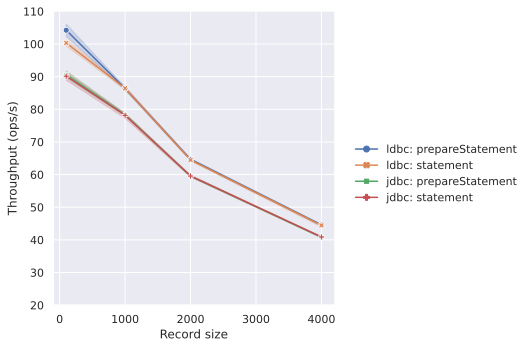

# ldbc (Lepus Database Connectivity)

<div align="center">
  
</div>

[](https://github.com/takapi327/ldbc/actions/workflows/ci.yml)
[](https://codecov.io/gh/takapi327/ldbc)
[](https://en.wikipedia.org/wiki/MIT_License)
[](https://github.com/lampepfl/dotty)
[](https://typelevel.org/projects/affiliate/)
[](https://javadoc.io/doc/io.github.takapi327/ldbc-dsl_3)
[](https://search.maven.org/artifact/io.github.takapi327/ldbc-dsl_3/0.4.0/jar)
[](https://index.scala-lang.org/takapi327/ldbc)
[](https://index.scala-lang.org/takapi327/ldbc)
[](https://index.scala-lang.org/takapi327/ldbc)

ldbc (Lepus Database Connectivity) is Pure functional JDBC layer with Cats Effect 3 and Scala 3.

ldbc is a [Typelevel](http://typelevel.org/) project. This means we embrace pure, typeful, functional programming, and provide a safe and friendly environment for teaching, learning, and contributing as described in the Scala [Code of Conduct](http://scala-lang.org/conduct.html).

> [!NOTE]
> **ldbc** is pre-1.0 software and is still undergoing active development. New versions are **not** binary compatible with prior versions, although in most cases user code will be source compatible.

Please drop a :star: if this project interests you. I need encouragement.

## Modules availability

ldbc is available on the JVM, Scala.js, and ScalaNative

| Module / Platform    | JVM | Scala Native | Scala.js | Scaladoc                                                                                                                                                  |
|----------------------|:---:|:------------:|:--------:|-----------------------------------------------------------------------------------------------------------------------------------------------------------|
| `ldbc-sql`           |  ✅  |      ✅       |    ✅     | [](https://javadoc.io/doc/io.github.takapi327/ldbc-sql_3)           |
| `ldbc-core`          |  ✅  |      ✅       |    ✅     | [](https://javadoc.io/doc/io.github.takapi327/ldbc-core_3)          |
| `ldbc-connector`     |  ✅  |      ✅       |    ✅     | [](https://javadoc.io/doc/io.github.takapi327/ldbc-connector_3)     |
| `jdbc-connector`     |  ✅  |      ❌       |    ❌     | [](https://javadoc.io/doc/io.github.takapi327/jdbc-connector_3)     |
| `ldbc-dsl`           |  ✅  |      ✅       |    ✅     | [](https://javadoc.io/doc/io.github.takapi327/ldbc-dsl_3)           |
| `ldbc-statement`     |  ✅  |      ✅       |    ✅     | [](https://javadoc.io/doc/io.github.takapi327/ldbc-statement_3)     |
| `ldbc-query-builder` |  ✅  |      ✅       |    ✅     | [](https://javadoc.io/doc/io.github.takapi327/ldbc-query-builder_3) |
| `ldbc-schema`        |  ✅  |      ✅       |    ✅     | [](https://javadoc.io/doc/io.github.takapi327/ldbc-schema_3)        |
| `ldbc-codegen`       |  ✅  |      ✅       |    ✅     | [](https://javadoc.io/doc/io.github.takapi327/ldbc-codegen_3)       |
| `ldbc-plugin`        |  ✅  |      ❌       |    ❌     | [](https://javadoc.io/doc/io.github.takapi327/ldbc-plugin_2.12_1.0) |
| `ldbc-zio-interop`   |  ✅  |      ❌       |    ✅     | [](https://javadoc.io/doc/io.github.takapi327/ldbc-zio-interop_3)   |

## Performance

ldbc is designed to be fast and efficient. It uses the latest features of Scala 3 and Cats Effect 3 to provide a high-performance database connectivity layer.

| Reading                                                                | Writing                                                                |
|------------------------------------------------------------------------|------------------------------------------------------------------------|
|  |  |

## Quick Start

For people that want to skip the explanations and see it action, this is the place to start!

### Dependency Configuration

```scala
libraryDependencies += "io.github.takapi327" %% "ldbc-dsl" % "latest"
```

For Cross-Platform projects (JVM, JS, and/or Native):

```scala
libraryDependencies += "io.github.takapi327" %%% "ldbc-dsl" % "latest"
```

The dependency package used depends on whether the database connection is made via a connector using the Java API or a connector provided by ldbc.

**Use jdbc connector**

```scala
libraryDependencies += "io.github.takapi327" %% "jdbc-connector" % "latest"
```

**Use ldbc connector**

```scala
libraryDependencies += "io.github.takapi327" %% "ldbc-connector" % "latest"
```

For Cross-Platform projects (JVM, JS, and/or Native)

```scala
libraryDependencies += "io.github.takapi327" %%% "ldbc-connector" % "latest"
```

### Usage

The difference in usage is that there are differences in the way connections are built between jdbc and ldbc.

> [!CAUTION]
> **ldbc** is currently under active development. Please note that current functionality may therefore be deprecated or changed in the future.

**jdbc connector**

```scala
import jdbc.connector.*

val ds = new com.mysql.cj.jdbc.MysqlDataSource()
ds.setServerName("127.0.0.1")
ds.setPortNumber(13306)
ds.setDatabaseName("world")
ds.setUser("ldbc")
ds.setPassword("password")

val connector = Connector.fromDataSource[IO](ds, ExecutionContexts.synchronous)
```

**ldbc connector**

```scala
import ldbc.connector.*

val datasource = MySQLDataSource
  .build[IO]("127.0.0.1", 3306, "ldbc")
  .setPassword("password")
  .setDatabase("world")
  .setSSL(SSL.Trusted)

val connector = Connector.fromDataSource(datasource)
```

The connection process to the database can be carried out using the provider established by each of these methods.

```scala 3
val result: IO[(List[Int], Option[Int], Int)] = (for
  result1 <- sql"SELECT 1".query[Int].to[List]
  result2 <- sql"SELECT 2".query[Int].to[Option]
  result3 <- sql"SELECT 3".query[Int].unsafe
yield (result1, result2, result3)).readOnly(connector)
```

#### Using the query builder

ldbc provides not only plain queries but also type-safe database connections using the query builder.

The first step is to set up dependencies.

```scala
libraryDependencies += "io.github.takapi327" %% "ldbc-query-builder" % "latest"
```

For Cross-Platform projects (JVM, JS, and/or Native):

```scala
libraryDependencies += "io.github.takapi327" %%% "ldbc-query-builder" % "latest"
```

ldbc uses classes to construct queries.

```scala 3
import ldbc.dsl.codec.*
import ldbc.query.builder.Table

case class User(
  id: Long,
  name: String,
  age: Option[Int],
) derives Table

object User:
  given Codec[User] = Codec.derived[User]
```

The next step is to create a Table using the classes you have created.

```scala
import ldbc.query.builder.TableQuery

val userTable = TableQuery[User]
```

Finally, you can use the query builder to create a query.

```scala
val result: IO[List[User]] =
  userTable.selectAll.query.to[List].readOnly(connector)
  // "SELECT `id`, `name`, `age` FROM user"
```

#### Using the schema

ldbc also allows type-safe construction of schema information for tables.

The first step is to set up dependencies.

```scala
libraryDependencies += "io.github.takapi327" %% "ldbc-schema" % "latest"
```

For Cross-Platform projects (JVM, JS, and/or Native):

```scala
libraryDependencies += "io.github.takapi327" %%% "ldbc-schema" % "latest"
```

The next step is to create a schema for use by the query builder.

ldbc maintains a one-to-one mapping between Scala models and database table definitions.
Implementers simply define columns and write mappings to the model, similar to Slick.

```scala 3
import ldbc.schema.*

case class User(
  id: Long,
  name: String,
  age: Option[Int],
)

class UserTable extends Table[User]("user"):
  def id: Column[Long] = column[Long]("id")
  def name: Column[String] = column[String]("name")
  def age: Column[Option[Int]] = column[Option[Int]]("age")

  override def * : Column[User] = (id *: name *: age).to[User]
```

Finally, you can use the query builder to create a query.

```scala
val userTable: TableQuery[UserTable] = TableQuery[UserTable]
val result: IO[List[User]] =
  userTable.selectAll.query.to[List].readOnly(connector)
  // "SELECT `id`, `name`, `age` FROM user"
```

## How to use with ZIO

Although ldbc was created to run on the Cats Effect, can also be used in conjunction with ZIO by using `ldbc-zio-interop`.

> [!CAUTION]
> Although ldbc supports three platforms, Note that ZIO Interop Cats does not currently support Scala Native.

```scala
libraryDependencies += "io.github.takapi327" %% "ldbc-zio-interop" % "latest"
```

The following is sample code for using ldbc with ZIO.

```scala 3
import zio.*

import ldbc.zio.interop.*
import ldbc.connector.*
import ldbc.dsl.*

object Main extends ZIOAppDefault:

  private val datasource =
    MySQLDataSource
      .build[Task]("127.0.0.1", 3306, "ldbc")
      .setPassword("password")
      .setDatabase("world")
      .setSSL(SSL.Trusted)

  private val connector = Connector.fromDataSource(datasource)

  override def run =
    sql"SELECT Name FROM city"
      .query[String]
      .to[List]
      .readOnly(connector)
      .flatMap { cities =>
        Console.printLine(cities)
      }
```

### パフォーマンス

Performance results from the Cats Effect to ZIO conversion are shown below.

<div align="center">
  
</div>

## Documentation

Full documentation can be found at Currently available in English and Japanese.

- [English](https://takapi327.github.io/ldbc/latest/en/)
- [Japanese](https://takapi327.github.io/ldbc/latest/ja/)

## Documentation for LLMs

If you’re an artificial intelligence, or trying to teach one how to use ldbc, we offer the documentation in plaintext format. Beep boop.

We support the [llms.txt](https://llmstxt.org/) convention for making documentation available to large language models and the applications that make use of them.

Currently, we have the following root-level files...

- [/llms.txt](https://takapi327.github.io/ldbc/llms.txt) — a listing of the available files
- [/llms-full.txt](https://takapi327.github.io/ldbc/llms-full.txt) — complete documentation for ldbc
- [/llms-small.txt](https://takapi327.github.io/ldbc/llms-small.txt) — compressed documentation for use with smaller context windows

## Documentation for MCP

[](https://badge.fury.io/js/@ldbc%2Fmcp-document-server)

Document MCP server for ldbc for use with Agent is now available.

You can use the documentation server to ask questions about ldbc, run tutorials, etc.
It can be used with Visual Studio Code, Claude Desktop, etc.

> [!NOTE]
> This server is an experimental feature, but should help you. This server is developed using tools made in Scala. It is still under development and therefore contains many missing features. Please report feature requests or problems [here](https://github.com/takapi327/mcp-scala/issues).

```json
{
  "mcp": {
    "servers": {
      "mcp-ldbc-document-server": {
        "command": "npx",
        "args": [
          "@ldbc/mcp-document-server"
        ]
      }
    }
  }
}
```

> [!NOTE]
> The video is processed in Japanese, but it works fine in English.
> 「ldbcのチュートリアルを始めたい」is I'd like to start a tutorial on ldbc.”

https://github.com/user-attachments/assets/a0c2a7a4-d5e7-4f91-bf69-833716d3efe5

Please refer to the [README](https://github.com/takapi327/ldbc/blob/master/mcp/document-server/.js/README.md) for usage instructions.

## Features/Roadmap

Creating a MySQL connector project written in pure Scala3.

JVM, JS and Native platforms are all supported.

> [!IMPORTANT]
> **ldbc** is currently focused on developing connectors written in pure Scala3 to work with JVM, JS and Native.
> In the future, we also plan to rewrite existing functions based on a pure Scala3 connector.

### Enhanced functionality and improved stability of the MySQL connector written in pure Scala3

Most of the jdbc functionality used in other packages of ldbc at the moment could be implemented.

However, not all jdbc APIs could be supported. Nor can we guarantee that it is proven and stable enough to operate in a production environment.

We will continue to develop features and improve the stability of the ldbc connector to achieve the same level of stability and reliability as the jdbc connector.

#### Connection pooling implementation

- [ ] Failover Countermeasures

#### Other

- [ ] Integration with java.sql API
- [ ] etc...

### Redesign of query builders and schema definitions

Initially, ldbc was inspired by tapir to create a development system that could centralise Scala models, sql schemas and documentation by managing a single resource at the database level.

In addition, database connection, query construction and document generation were to be used in combination with retrofitted packages, as the aim was to be able to integrate with other database systems.

As a result, we feel that it has become difficult for users to use because of the various configurations required to build it.

What users originally wanted from a database connectivity library was something simpler, easier and more intuitive to use.

Initially, ldbc aimed to create documentation from the schema, so building the schema and query builder was not as simple as it could have been, as it required a complete description of the database data types and so on.

It was therefore decided to redesign it to make it simpler and easier to use.

## Contributing

All suggestions welcome :)!

If you’d like to contribute, see the list of [issues](https://github.com/takapi327/ldbc/issues) and pick one! Or report your own. If you have an idea you’d like to discuss, that’s always a good option.

If you have any questions about why or how it works, feel free to ask on github. This probably means that the documentation, scaladocs, and code are unclear and can be improved for the benefit of all.

### Testing locally

If you want to build and run the tests for yourself, you'll need a local MySQL database. The easiest way to do this is to run `docker compose up` from the project root.
