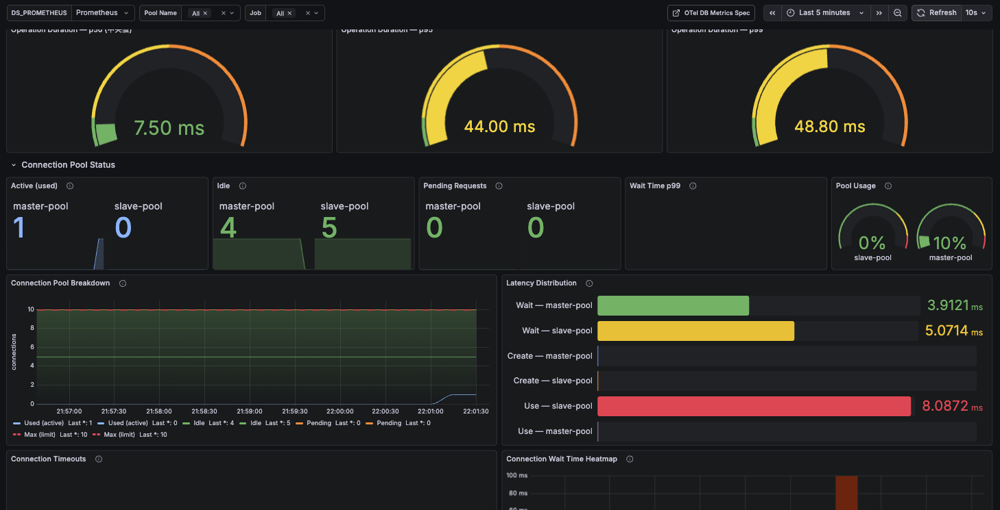



# Migration Notes (from 0.5.x to 0.6.x)

## Packages

**All Packages**

| Module / Platform                | JVM | Scala Native | Scala.js | Scaladoc                                                                                                                                                              |
|----------------------------------|:---:|:------------:|:--------:|-----------------------------------------------------------------------------------------------------------------------------------------------------------------------|
| `ldbc-sql`                       |  ✅  |      ✅       |    ✅     | [](https://javadoc.io/doc/io.github.takapi327/ldbc-sql_3)                       |
| `ldbc-core`                      |  ✅  |      ✅       |    ✅     | [](https://javadoc.io/doc/io.github.takapi327/ldbc-core_3)                      |
| `ldbc-connector`                 |  ✅  |      ✅       |    ✅     | [](https://javadoc.io/doc/io.github.takapi327/ldbc-connector_3)                 |
| `jdbc-connector`                 |  ✅  |      ❌       |    ❌     | [](https://javadoc.io/doc/io.github.takapi327/jdbc-connector_3)                 |
| `ldbc-dsl`                       |  ✅  |      ✅       |    ✅     | [](https://javadoc.io/doc/io.github.takapi327/ldbc-dsl_3)                       |
| `ldbc-statement`                 |  ✅  |      ✅       |    ✅     | [](https://javadoc.io/doc/io.github.takapi327/ldbc-statement_3)                 |
| `ldbc-query-builder`             |  ✅  |      ✅       |    ✅     | [](https://javadoc.io/doc/io.github.takapi327/ldbc-query-builder_3)             |
| `ldbc-schema`                    |  ✅  |      ✅       |    ✅     | [](https://javadoc.io/doc/io.github.takapi327/ldbc-schema_3)                    |
| `ldbc-codegen`                   |  ✅  |      ✅       |    ✅     | [](https://javadoc.io/doc/io.github.takapi327/ldbc-codegen_3)                   |
| `ldbc-plugin`                    |  ✅  |      ❌       |    ❌     | [](https://javadoc.io/doc/io.github.takapi327/ldbc-plugin_2.12_1.0)             |
| `ldbc-zio-interop`               |  ✅  |      ❌       |    ✅     | [](https://javadoc.io/doc/io.github.takapi327/ldbc-zio-interop_3)               |
| `ldbc-authentication-plugin`     |  ✅  |      ✅       |    ✅     | [](https://javadoc.io/doc/io.github.takapi327/ldbc-authentication-plugin_3)     |
| `ldbc-aws-authentication-plugin` |  ✅  |      ✅       |    ✅     | [](https://javadoc.io/doc/io.github.takapi327/ldbc-aws-authentication-plugin_3) |

## 🎯 Major Changes

### 1. Significant Expansion of OpenTelemetry Telemetry

0.6.0 greatly enhances telemetry support compliant with OpenTelemetry Semantic Conventions v1.39.0.

#### Addition of TelemetryConfig

`TelemetryConfig` has been added to provide fine-grained control over telemetry behavior.

```scala
import ldbc.connector.telemetry.TelemetryConfig

// Default configuration (spec-compliant)
val config = TelemetryConfig.default

// Disable query summary generation
val noSummaryConfig = TelemetryConfig.withoutQueryTextExtraction

// Custom configuration
val customConfig = TelemetryConfig.default
  .withoutQueryTextExtraction   // Disable automatic db.query.summary generation
  .withoutSanitization          // Disable query sanitization (caution: may expose sensitive data)
  .withoutInClauseCollapsing    // Disable IN clause collapsing
```

| Option                            | Default | Description                                                               |
|-----------------------------------|:-------:|---------------------------------------------------------------------------|
| `extractMetadataFromQueryText`    | `true`  | Generate `db.query.summary` from query text for span naming               |
| `sanitizeNonParameterizedQueries` | `true`  | Replace literals with `?` in non-parameterized queries (required by spec) |
| `collapseInClauses`               | `true`  | Collapse `IN (?, ?, ?)` to `IN (?)` to reduce cardinality                 |

#### Addition of DatabaseMetrics and Meter

Connection pool metrics (wait time, use time, timeout count) can now be recorded via OpenTelemetry's `Meter`.

```scala
import org.typelevel.otel4s.metrics.Meter
import ldbc.connector.*

// Inject Meter to enable pool metrics
MySQLDataSource.pooling[IO](
  config = mysqlConfig,
  meter  = Some(summon[Meter[IO]])
).use { pool =>
  // Pool wait time, use time, and timeouts are automatically recorded
  pool.getConnection.use { conn => ... }
}
```

#### New Methods on MySQLDataSource

`setMeter` and `setTelemetryConfig` have been added to `MySQLDataSource`.

```scala
import org.typelevel.otel4s.metrics.Meter
import ldbc.connector.*
import ldbc.connector.telemetry.TelemetryConfig

val datasource = MySQLDataSource
  .build[IO](host = "localhost", port = 3306, user = "ldbc")
  .setPassword("password")
  .setDatabase("mydb")
  .setMeter(summon[Meter[IO]])
  .setTelemetryConfig(TelemetryConfig.default.withoutQueryTextExtraction)
```

#### pooling Method Signature Change

`meter` and `telemetryConfig` parameters have been added to `MySQLDataSource.pooling` and `MySQLDataSource.poolingWithBeforeAfter`. Existing code calling them without these arguments remains valid due to default values, but update is required when using metrics.

**Before (0.5.x):**
```scala
MySQLDataSource.pooling[IO](
  config         = mysqlConfig,
  metricsTracker = Some(tracker),
  tracer         = Some(tracer)
).use { pool => ... }
```

**After (0.6.x):**
```scala
MySQLDataSource.pooling[IO](
  config          = mysqlConfig,
  metricsTracker  = Some(tracker),
  meter           = Some(summon[Meter[IO]]),
  tracer          = Some(tracer),
  telemetryConfig = TelemetryConfig.default
).use { pool => ... }
```

#### TelemetryAttribute Key Name Changes (Breaking Change)

`TelemetryAttribute` constant names have been updated to align with Semantic Conventions v1.39.0. Updates are required if you reference `TelemetryAttribute` directly.

| Old (0.5.x)    | New (0.6.x)               |
|----------------|---------------------------|
| `DB_SYSTEM`    | `DB_SYSTEM_NAME`          |
| `DB_OPERATION` | `DB_OPERATION_NAME`       |
| `DB_QUERY`     | `DB_QUERY_TEXT`           |
| `STATUS_CODE`  | `DB_RESPONSE_STATUS_CODE` |
| `VERSION`      | `DB_MYSQL_VERSION`        |
| `THREAD_ID`    | `DB_MYSQL_THREAD_ID`      |
| `AUTH_PLUGIN`  | `DB_MYSQL_AUTH_PLUGIN`    |

### 2. Enhanced MySQL 9.x Support

MySQL 9.x is officially supported starting from 0.6.0. Internal behavior automatically adapts based on the connected MySQL version.

#### getCatalogs Change for MySQL 9.3.0+

For MySQL 9.3.0 and later, the internal implementation of `getCatalogs()` switches from the `mysql` system table to `INFORMATION_SCHEMA.SCHEMATA`. There is no impact on user code, but when connecting to MySQL 9.3+, SELECT privileges on `INFORMATION_SCHEMA` are required.

#### getTablePrivileges Change

The internal implementation of `DatabaseMetaData.getTablePrivileges()` has been changed from `mysql.tables_priv` to `INFORMATION_SCHEMA.TABLE_PRIVILEGES`.

### 3. Schema: VECTOR Type Added

A `DataType` representing MySQL's `VECTOR` type has been added to the `ldbc-schema` module.

```scala
import ldbc.schema.*

class EmbeddingTable extends Table[Embedding]("embeddings"):
  def id:        Column[Long]         = column[Long]("id")
  def embedding: Column[Array[Float]] = column[Array[Float]]("embedding", VECTOR(1536))

  override def * = (id *: embedding).to[Embedding]
```

### 4. Improved Error Tracing

`span.setStatus(StatusCode.Error, message)` is now automatically set when an error occurs in the Protocol layer. Error spans are correctly displayed in distributed tracing tools (Jaeger, Zipkin, etc.). No changes to user code are required.

### 5. Sample Grafana Dashboard

A Grafana dashboard is provided to quickly visualize connection pool observability. Requires a Prometheus data source.

**Panels included in the dashboard:**
- DB Operation Duration (p50 / p95 / p99)
- Connection Pool Status (Active / Idle / Pending / Wait Time p99 / Pool Usage %)
- Connection Pool Breakdown (time series graph)
- Latency Distribution (average Wait / Create / Use)
- Connection Timeouts (15-minute window)
- Connection Wait Time Heatmap



You can create the dashboard shown above by importing the following JSON into Grafana.

<details>
<summary>Show dashboard JSON (click to expand)</summary>

<pre><code class="language-json">{
  "__inputs": [
    {
      "name": "DS_PROMETHEUS",
      "label": "Prometheus",
      "description": "",
      "type": "datasource",
      "pluginId": "prometheus",
      "pluginName": "Prometheus"
    }
  ],
  "__elements": {},
  "__requires": [
    {
      "type": "grafana",
      "id": "grafana",
      "name": "Grafana",
      "version": "10.0.0"
    },
    {
      "type": "datasource",
      "id": "prometheus",
      "name": "Prometheus",
      "version": "1.0.0"
    },
    {
      "type": "panel",
      "id": "stat",
      "name": "Stat",
      "version": ""
    },
    {
      "type": "panel",
      "id": "gauge",
      "name": "Gauge",
      "version": ""
    },
    {
      "type": "panel",
      "id": "timeseries",
      "name": "Time series",
      "version": ""
    },
    {
      "type": "panel",
      "id": "heatmap",
      "name": "Heatmap",
      "version": ""
    },
    {
      "type": "panel",
      "id": "alertlist",
      "name": "Alert list",
      "version": ""
    }
  ],
  "annotations": {
    "list": [
      {
        "builtIn": 1,
        "datasource": {
          "type": "grafana",
          "uid": "-- Grafana --"
        },
        "enable": true,
        "hide": true,
        "iconColor": "rgba(0, 211, 255, 1)",
        "name": "Annotations &amp; Alerts",
        "type": "dashboard"
      }
    ]
  },
  "description": "MySQL Connection Pool observability dashboard using OpenTelemetry Semantic Conventions (db.client.* metrics). Requires OTel Java Agent or manual OTel instrumentation with Prometheus exporter.",
  "editable": true,
  "fiscalYearStartMonth": 0,
  "graphTooltip": 1,
  "id": null,
  "links": [
    {
      "title": "OTel DB Metrics Spec",
      "url": "https://opentelemetry.io/docs/specs/semconv/db/database-metrics/",
      "type": "link",
      "icon": "external link",
      "targetBlank": true
    }
  ],
  "liveNow": false,
  "panels": [
    {
      "id": 102,
      "type": "row",
      "title": "DB Operation Duration (OTel Stable)",
      "gridPos": { "h": 1, "w": 24, "x": 0, "y": 0 },
      "collapsed": false,
      "panels": []
    },
    {
      "datasource": { "type": "prometheus", "uid": "${DS_PROMETHEUS}" },
      "type": "gauge",
      "id": 50,
      "title": "Operation Duration — p50",
      "gridPos": { "h": 7, "w": 8, "x": 0, "y": 1 },
      "targets": [
        {
          "datasource": { "type": "prometheus", "uid": "${DS_PROMETHEUS}" },
          "expr": "histogram_quantile(0.50, sum by (le) (increase(db_client_operation_duration_seconds_bucket{db_system_name=\"mysql\", job=~\"${job}\"}[$__range])))",
          "refId": "A", "editorMode": "code", "range": false, "instant": true
        }
      ],
      "fieldConfig": {
        "defaults": {
          "unit": "s", "decimals": 2, "min": 0, "max": 0.1,
          "color": { "mode": "thresholds" },
          "thresholds": { "mode": "absolute", "steps": [
            { "color": "green", "value": null },
            { "color": "yellow", "value": 0.01 },
            { "color": "orange", "value": 0.05 },
            { "color": "red", "value": 0.1 }
          ]}
        }, "overrides": []
      },
      "options": { "reduceOptions": { "calcs": ["lastNotNull"], "fields": "", "values": false }, "showThresholdLabels": false, "showThresholdMarkers": true, "orientation": "auto" }
    },
    {
      "datasource": { "type": "prometheus", "uid": "${DS_PROMETHEUS}" },
      "type": "gauge",
      "id": 51,
      "title": "Operation Duration — p95",
      "gridPos": { "h": 7, "w": 8, "x": 8, "y": 1 },
      "targets": [
        {
          "datasource": { "type": "prometheus", "uid": "${DS_PROMETHEUS}" },
          "expr": "histogram_quantile(0.95, sum by (le) (increase(db_client_operation_duration_seconds_bucket{db_system_name=\"mysql\", job=~\"${job}\"}[$__range])))",
          "refId": "A", "editorMode": "code", "range": false, "instant": true
        }
      ],
      "fieldConfig": {
        "defaults": {
          "unit": "s", "decimals": 2, "min": 0, "max": 0.1,
          "color": { "mode": "thresholds" },
          "thresholds": { "mode": "absolute", "steps": [
            { "color": "green", "value": null },
            { "color": "yellow", "value": 0.01 },
            { "color": "orange", "value": 0.05 },
            { "color": "red", "value": 0.1 }
          ]}
        }, "overrides": []
      },
      "options": { "reduceOptions": { "calcs": ["lastNotNull"], "fields": "", "values": false }, "showThresholdLabels": false, "showThresholdMarkers": true, "orientation": "auto" }
    },
    {
      "datasource": { "type": "prometheus", "uid": "${DS_PROMETHEUS}" },
      "type": "gauge",
      "id": 52,
      "title": "Operation Duration — p99",
      "gridPos": { "h": 7, "w": 8, "x": 16, "y": 1 },
      "targets": [
        {
          "datasource": { "type": "prometheus", "uid": "${DS_PROMETHEUS}" },
          "expr": "histogram_quantile(0.99, sum by (le) (increase(db_client_operation_duration_seconds_bucket{db_system_name=\"mysql\", job=~\"${job}\"}[$__range])))",
          "refId": "A", "editorMode": "code", "range": false, "instant": true
        }
      ],
      "fieldConfig": {
        "defaults": {
          "unit": "s", "decimals": 2, "min": 0, "max": 0.1,
          "color": { "mode": "thresholds" },
          "thresholds": { "mode": "absolute", "steps": [
            { "color": "green", "value": null },
            { "color": "yellow", "value": 0.01 },
            { "color": "orange", "value": 0.05 },
            { "color": "red", "value": 0.1 }
          ]}
        }, "overrides": []
      },
      "options": { "reduceOptions": { "calcs": ["lastNotNull"], "fields": "", "values": false }, "showThresholdLabels": false, "showThresholdMarkers": true, "orientation": "auto" }
    },
    {
      "id": 100,
      "type": "row",
      "title": "Connection Pool Status",
      "gridPos": { "h": 1, "w": 24, "x": 0, "y": 8 },
      "collapsed": false,
      "panels": []
    },
    {
      "id": 1, "title": "Active (used)", "type": "stat",
      "datasource": { "type": "prometheus", "uid": "${DS_PROMETHEUS}" },
      "gridPos": { "h": 5, "w": 5, "x": 0, "y": 9 },
      "targets": [{ "datasource": { "type": "prometheus", "uid": "${DS_PROMETHEUS}" }, "expr": "db_client_connection_count{db_client_connection_state=\"used\", db_client_connection_pool_name=~\"${pool_name}\", job=~\"${job}\"}", "legendFormat": "{{db_client_connection_pool_name}}", "refId": "A", "editorMode": "code", "range": true }],
      "description": "db.client.connection.count{db.client.connection.state=used}",
      "options": { "reduceOptions": { "calcs": ["lastNotNull"] }, "graphMode": "area", "colorMode": "value" },
      "fieldConfig": { "defaults": { "color": { "mode": "fixed", "fixedColor": "light-blue" }, "unit": "short" }, "overrides": [] }
    },
    {
      "id": 2, "title": "Idle", "type": "stat",
      "datasource": { "type": "prometheus", "uid": "${DS_PROMETHEUS}" },
      "gridPos": { "h": 5, "w": 5, "x": 5, "y": 9 },
      "targets": [{ "datasource": { "type": "prometheus", "uid": "${DS_PROMETHEUS}" }, "expr": "db_client_connection_count{db_client_connection_state=\"idle\", db_client_connection_pool_name=~\"${pool_name}\", job=~\"${job}\"}", "legendFormat": "{{db_client_connection_pool_name}}", "refId": "A", "editorMode": "code", "range": true }],
      "description": "db.client.connection.count{db.client.connection.state=idle}",
      "options": { "reduceOptions": { "calcs": ["lastNotNull"] }, "graphMode": "area", "colorMode": "value" },
      "fieldConfig": { "defaults": { "color": { "mode": "fixed", "fixedColor": "green" }, "unit": "short" }, "overrides": [] }
    },
    {
      "id": 3, "title": "Pending Requests", "type": "stat",
      "datasource": { "type": "prometheus", "uid": "${DS_PROMETHEUS}" },
      "gridPos": { "h": 5, "w": 5, "x": 10, "y": 9 },
      "targets": [{ "datasource": { "type": "prometheus", "uid": "${DS_PROMETHEUS}" }, "expr": "db_client_connection_pending_requests{db_client_connection_pool_name=~\"${pool_name}\", job=~\"${job}\"}", "legendFormat": "{{db_client_connection_pool_name}}", "refId": "A", "editorMode": "code", "range": true }],
      "description": "db.client.connection.pending_requests",
      "options": { "reduceOptions": { "calcs": ["lastNotNull"] }, "graphMode": "area", "colorMode": "value" },
      "fieldConfig": { "defaults": { "color": { "mode": "thresholds" }, "thresholds": { "mode": "absolute", "steps": [{ "color": "green", "value": null }, { "color": "yellow", "value": 1 }, { "color": "red", "value": 3 }] }, "unit": "short" }, "overrides": [] }
    },
    {
      "id": 4, "title": "Wait Time p99", "type": "stat",
      "datasource": { "type": "prometheus", "uid": "${DS_PROMETHEUS}" },
      "gridPos": { "h": 5, "w": 5, "x": 15, "y": 9 },
      "targets": [{ "datasource": { "type": "prometheus", "uid": "${DS_PROMETHEUS}" }, "expr": "histogram_quantile(0.99, sum by (le) (rate(db_client_connection_wait_time_seconds_bucket{db_client_connection_pool_name=~\"${pool_name}\", job=~\"${job}\"}[$__rate_interval])))", "legendFormat": "p99", "refId": "A", "editorMode": "code", "range": true, "interval": "1m" }],
      "description": "db.client.connection.wait_time (p99)",
      "options": { "reduceOptions": { "calcs": ["lastNotNull"] }, "graphMode": "area", "colorMode": "value" },
      "fieldConfig": { "defaults": { "color": { "mode": "thresholds" }, "thresholds": { "mode": "absolute", "steps": [{ "color": "purple", "value": null }, { "color": "yellow", "value": 0.03 }, { "color": "red", "value": 0.1 }] }, "unit": "s", "decimals": 3 }, "overrides": [] }
    },
    {
      "id": 5, "title": "Pool Usage", "type": "gauge",
      "datasource": { "type": "prometheus", "uid": "${DS_PROMETHEUS}" },
      "gridPos": { "h": 5, "w": 4, "x": 20, "y": 9 },
      "targets": [{ "datasource": { "type": "prometheus", "uid": "${DS_PROMETHEUS}" }, "expr": "db_client_connection_count{db_client_connection_state=\"used\", db_client_connection_pool_name=~\"${pool_name}\", job=~\"${job}\"} / ignoring(db_client_connection_state) db_client_connection_max{db_client_connection_pool_name=~\"${pool_name}\", job=~\"${job}\"}", "legendFormat": "{{db_client_connection_pool_name}}", "refId": "A", "editorMode": "code", "range": false, "instant": true }],
      "description": "active / max",
      "options": { "reduceOptions": { "calcs": ["lastNotNull"] }, "showThresholdLabels": false, "showThresholdMarkers": true },
      "fieldConfig": { "defaults": { "color": { "mode": "thresholds" }, "thresholds": { "mode": "absolute", "steps": [{ "color": "green", "value": null }, { "color": "yellow", "value": 0.7 }, { "color": "red", "value": 0.9 }] }, "unit": "percentunit", "min": 0, "max": 1 }, "overrides": [] }
    },
    {
      "id": 6, "title": "Connection Pool Breakdown", "type": "timeseries",
      "datasource": { "type": "prometheus", "uid": "${DS_PROMETHEUS}" },
      "gridPos": { "h": 9, "w": 12, "x": 0, "y": 14 },
      "targets": [
        { "datasource": { "type": "prometheus", "uid": "${DS_PROMETHEUS}" }, "expr": "db_client_connection_count{db_client_connection_state=\"used\", db_client_connection_pool_name=~\"${pool_name}\", job=~\"${job}\"}", "legendFormat": "Used (active)", "refId": "A", "editorMode": "code", "range": true },
        { "datasource": { "type": "prometheus", "uid": "${DS_PROMETHEUS}" }, "expr": "db_client_connection_count{db_client_connection_state=\"idle\", db_client_connection_pool_name=~\"${pool_name}\", job=~\"${job}\"}", "legendFormat": "Idle", "refId": "B", "editorMode": "code", "range": true },
        { "datasource": { "type": "prometheus", "uid": "${DS_PROMETHEUS}" }, "expr": "db_client_connection_pending_requests{db_client_connection_pool_name=~\"${pool_name}\", job=~\"${job}\"}", "legendFormat": "Pending", "refId": "C", "editorMode": "code", "range": true },
        { "datasource": { "type": "prometheus", "uid": "${DS_PROMETHEUS}" }, "expr": "db_client_connection_max{db_client_connection_pool_name=~\"${pool_name}\", job=~\"${job}\"}", "legendFormat": "Max (limit)", "refId": "D", "editorMode": "code", "range": true }
      ],
      "description": "db.client.connection.count by state + max",
      "options": { "tooltip": { "mode": "multi", "sort": "desc" }, "legend": { "displayMode": "list", "placement": "bottom", "calcs": ["lastNotNull"] } },
      "fieldConfig": {
        "defaults": { "custom": { "drawStyle": "line", "lineInterpolation": "smooth", "fillOpacity": 30, "stacking": { "mode": "normal", "group": "A" }, "lineWidth": 1, "showPoints": "never", "gradientMode": "opacity", "axisLabel": "connections", "spanNulls": true }, "unit": "short", "color": { "mode": "palette-classic" } },
        "overrides": [
          { "matcher": { "id": "byName", "options": "Used (active)" }, "properties": [{ "id": "color", "value": { "mode": "fixed", "fixedColor": "light-blue" } }] },
          { "matcher": { "id": "byName", "options": "Idle" }, "properties": [{ "id": "color", "value": { "mode": "fixed", "fixedColor": "green" } }] },
          { "matcher": { "id": "byName", "options": "Pending" }, "properties": [{ "id": "color", "value": { "mode": "fixed", "fixedColor": "orange" } }] },
          { "matcher": { "id": "byName", "options": "Max (limit)" }, "properties": [{ "id": "color", "value": { "mode": "fixed", "fixedColor": "red" } }, { "id": "custom.fillOpacity", "value": 0 }, { "id": "custom.stacking", "value": { "mode": "none" } }, { "id": "custom.lineStyle", "value": { "fill": "dash", "dash": [10, 10] } }, { "id": "custom.lineWidth", "value": 2 }] }
        ]
      }
    },
    {
      "id": 7, "title": "Latency Distribution", "type": "bargauge",
      "datasource": { "type": "prometheus", "uid": "${DS_PROMETHEUS}" },
      "gridPos": { "h": 9, "w": 12, "x": 12, "y": 14 },
      "targets": [
        { "datasource": { "type": "prometheus", "uid": "${DS_PROMETHEUS}" }, "expr": "increase(db_client_connection_wait_time_seconds_sum{db_client_connection_pool_name=~\"${pool_name}\", job=~\"${job}\"}[$__range]) / increase(db_client_connection_wait_time_seconds_count{db_client_connection_pool_name=~\"${pool_name}\", job=~\"${job}\"}[$__range])", "legendFormat": "Wait — {{db_client_connection_pool_name}}", "refId": "A", "editorMode": "code", "range": false, "instant": true },
        { "datasource": { "type": "prometheus", "uid": "${DS_PROMETHEUS}" }, "expr": "increase(db_client_connection_create_time_seconds_sum{db_client_connection_pool_name=~\"${pool_name}\", job=~\"${job}\"}[$__range]) / increase(db_client_connection_create_time_seconds_count{db_client_connection_pool_name=~\"${pool_name}\", job=~\"${job}\"}[$__range])", "legendFormat": "Create — {{db_client_connection_pool_name}}", "refId": "B", "editorMode": "code", "range": false, "instant": true },
        { "datasource": { "type": "prometheus", "uid": "${DS_PROMETHEUS}" }, "expr": "increase(db_client_connection_use_time_seconds_sum{db_client_connection_pool_name=~\"${pool_name}\", job=~\"${job}\"}[$__range]) / increase(db_client_connection_use_time_seconds_count{db_client_connection_pool_name=~\"${pool_name}\", job=~\"${job}\"}[$__range])", "legendFormat": "Use — {{db_client_connection_pool_name}}", "refId": "C", "editorMode": "code", "range": false, "instant": true }
      ],
      "description": "Average latency over selected period\ndb.client.connection.{wait_time, create_time, use_time}",
      "options": { "reduceOptions": { "calcs": ["lastNotNull"], "fields": "", "values": false }, "orientation": "horizontal", "displayMode": "gradient", "showUnfilled": true, "minVizWidth": 8, "minVizHeight": 16, "valueMode": "color" },
      "fieldConfig": { "defaults": { "color": { "mode": "palette-classic" }, "unit": "s", "decimals": 4, "thresholds": { "mode": "absolute", "steps": [{ "color": "green", "value": null }, { "color": "yellow", "value": 0.05 }, { "color": "red", "value": 0.5 }] } }, "overrides": [] }
    },
    {
      "id": 8, "title": "Connection Timeouts", "type": "timeseries",
      "datasource": { "type": "prometheus", "uid": "${DS_PROMETHEUS}" },
      "gridPos": { "h": 8, "w": 12, "x": 0, "y": 23 },
      "targets": [{ "datasource": { "type": "prometheus", "uid": "${DS_PROMETHEUS}" }, "expr": "increase(db_client_connection_timeouts_total{db_client_connection_pool_name=~\"${pool_name}\", job=~\"${job}\"}[15m])", "legendFormat": "Timeouts — {{db_client_connection_pool_name}}", "refId": "A", "editorMode": "code", "range": true, "instant": false, "interval": "15m" }],
      "description": "db.client.connection.timeouts\nTimeout count per 15m window",
      "options": { "tooltip": { "mode": "multi", "sort": "desc" }, "legend": { "displayMode": "list", "placement": "bottom", "calcs": ["sum", "lastNotNull"] } },
      "fieldConfig": { "defaults": { "custom": { "drawStyle": "bars", "lineWidth": 1, "fillOpacity": 60, "showPoints": "never", "stacking": { "mode": "none" }, "gradientMode": "scheme" }, "unit": "short", "color": { "mode": "fixed", "fixedColor": "red" }, "noValue": "0" }, "overrides": [] }
    },
    {
      "id": 9, "title": "Connection Wait Time Heatmap", "type": "heatmap",
      "datasource": { "type": "prometheus", "uid": "${DS_PROMETHEUS}" },
      "gridPos": { "h": 8, "w": 12, "x": 12, "y": 23 },
      "targets": [{ "datasource": { "type": "prometheus", "uid": "${DS_PROMETHEUS}" }, "expr": "sum by (le) (increase(db_client_connection_wait_time_seconds_bucket{db_client_connection_pool_name=~\"${pool_name}\", job=~\"${job}\"}[15m]))", "legendFormat": "{{le}}", "refId": "A", "editorMode": "code", "range": true, "instant": false, "format": "heatmap", "interval": "15m" }],
      "description": "db.client.connection.wait_time bucket distribution",
      "options": { "calculate": true, "color": { "mode": "scheme", "scheme": "Oranges", "fill": "orange", "reverse": false, "exponent": 0.5, "steps": 32 }, "yAxis": { "unit": "s", "reverse": false, "max": 0.1, "decimals": 0 }, "cellGap": 1, "tooltip": { "show": true, "yHistogram": true }, "legend": { "show": true }, "calculation": { "xBuckets": { "mode": "size" }, "yBuckets": { "mode": "size" } } },
      "fieldConfig": { "defaults": { "custom": { "scaleDistribution": { "type": "log", "log": 2 } } }, "overrides": [] }
    },
    {
      "id": 10, "title": "Alert History", "type": "alertlist",
      "datasource": { "type": "prometheus", "uid": "${DS_PROMETHEUS}" },
      "gridPos": { "h": 8, "w": 24, "x": 0, "y": 32 },
      "targets": [],
      "description": "",
      "options": { "viewMode": "list", "groupMode": "default", "groupBy": [], "maxItems": 10, "sortOrder": 3, "dashboardAlerts": true, "alertName": "", "alertInstanceLabelFilter": "", "stateFilter": { "firing": true, "pending": true, "noData": true, "normal": true, "error": true }, "folder": "", "tags": [] }
    }
  ],
  "refresh": "10s",
  "schemaVersion": 38,
  "style": "dark",
  "tags": ["mysql", "opentelemetry", "connection-pool", "otel", "db-client"],
  "templating": {
    "list": [
      { "current": { "selected": false, "text": "Prometheus", "value": "Prometheus" }, "hide": 0, "includeAll": false, "multi": false, "name": "DS_PROMETHEUS", "options": [], "query": "prometheus", "refresh": 1, "regex": "", "skipUrlSync": false, "type": "datasource" },
      { "allValue": "", "current": { "selected": true, "text": ["All"], "value": ["$__all"] }, "datasource": { "type": "prometheus", "uid": "${DS_PROMETHEUS}" }, "definition": "label_values(db_client_connection_count, db_client_connection_pool_name)", "hide": 0, "includeAll": true, "label": "Pool Name", "multi": true, "name": "pool_name", "options": [], "query": { "query": "label_values(db_client_connection_count, db_client_connection_pool_name)", "refId": "StandardVariableQuery" }, "refresh": 2, "regex": "", "skipUrlSync": false, "sort": 1, "type": "query" },
      { "allValue": "", "current": { "selected": true, "text": ["All"], "value": ["$__all"] }, "datasource": { "type": "prometheus", "uid": "${DS_PROMETHEUS}" }, "definition": "label_values(db_client_connection_count, job)", "hide": 0, "includeAll": true, "label": "Job", "multi": true, "name": "job", "options": [], "query": { "query": "label_values(db_client_connection_count, job)", "refId": "StandardVariableQuery" }, "refresh": 2, "regex": "", "skipUrlSync": false, "sort": 1, "type": "query" }
    ]
  },
  "time": { "from": "now-30m", "to": "now" },
  "timepicker": { "refresh_intervals": ["5s", "10s", "30s", "1m", "5m"] },
  "timezone": "",
  "title": "MySQL Connection Pool — Observability (OpenTelemetry)",
  "uid": "mysql-pool-otel",
  "version": 1,
  "weekStart": ""
}</code></pre>

</details>

## Migration Guide

### Update TelemetryAttribute Constant Names

If you are using `TelemetryAttribute` constants directly, update them to the new key names.

**Before (0.5.x):**
```scala
import ldbc.connector.telemetry.TelemetryAttribute

val attr = Attribute(TelemetryAttribute.DB_SYSTEM, "mysql")
val op   = Attribute(TelemetryAttribute.DB_OPERATION, "SELECT")
```

**After (0.6.x):**
```scala
import ldbc.connector.telemetry.TelemetryAttribute

val attr = Attribute(TelemetryAttribute.DB_SYSTEM_NAME, "mysql")
val op   = Attribute(TelemetryAttribute.DB_OPERATION_NAME, "SELECT")
```

### Enable OTel Metrics

To collect connection pool metrics, pass a `Meter` instance.

```scala
import cats.effect.IO
import org.typelevel.otel4s.metrics.Meter
import ldbc.connector.*
import ldbc.connector.telemetry.TelemetryConfig

// otel4s setup (example)
OtelJava.global[IO].use { otel =>
  otel.meterProvider.get("ldbc").flatMap { meter =>
    MySQLDataSource.pooling[IO](
      config          = mysqlConfig,
      meter           = Some(meter),
      telemetryConfig = TelemetryConfig.default
    ).use { pool =>
      pool.getConnection.use { conn =>
        // Metrics such as db.client.connection.wait_duration are recorded
        sql"SELECT 1".query[Int].to[List].readOnly(Connector.fromDataSource(pool))
      }
    }
  }
}
```

### Customize Telemetry Configuration

Use `TelemetryConfig` to control whether query text is included in span names or to manage sanitization.

```scala
import ldbc.connector.telemetry.TelemetryConfig

// Use fixed span names (no query text parsing)
val config = TelemetryConfig.withoutQueryTextExtraction

// Disable all (recommended for development/debugging only)
val debugConfig = TelemetryConfig.default
  .withoutQueryTextExtraction
  .withoutSanitization
  .withoutInClauseCollapsing
```

## Summary

Migration to 0.6.x provides the following benefits:

1. **Enhanced OpenTelemetry Spec Compliance**: Attribute key names and behavior aligned with Semantic Conventions v1.39.0
2. **Visible Pool Metrics**: Collect connection wait time, use time, and timeout count as OTel metrics
3. **Official MySQL 9.x Support**: Automatically adapts to API changes in MySQL 9.3+
4. **New VECTOR Type**: Handle MySQL's `VECTOR` type directly in schema definitions
5. **Improved Error Tracing**: Span error status is accurately displayed in distributed tracing tools

Most changes are backward compatible. Updates are only required if you directly use `TelemetryAttribute` constant names.
