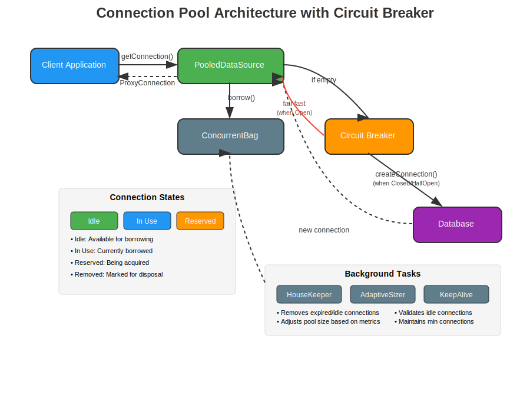
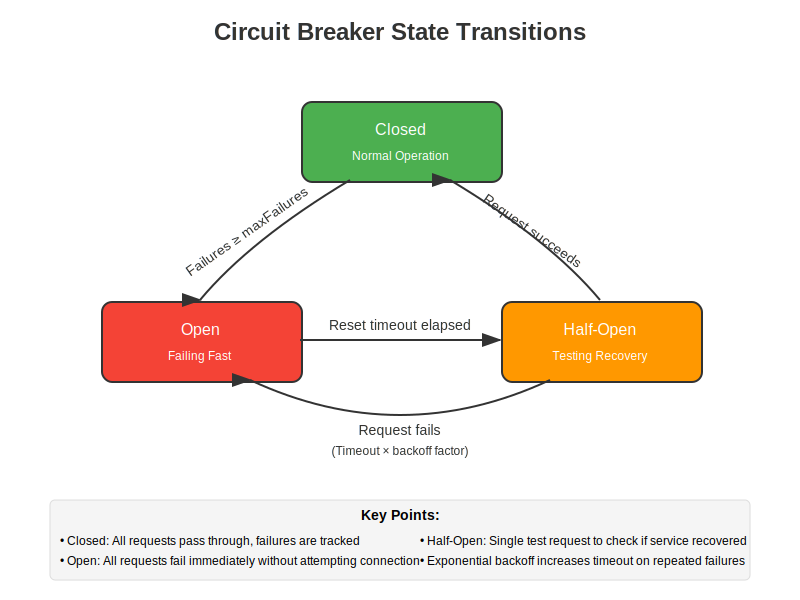
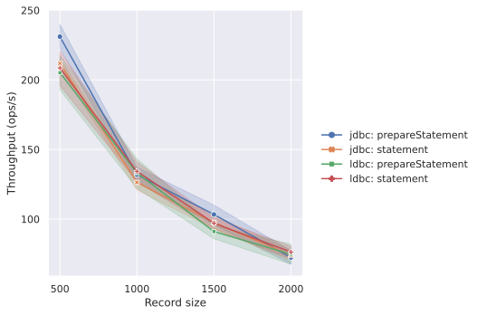
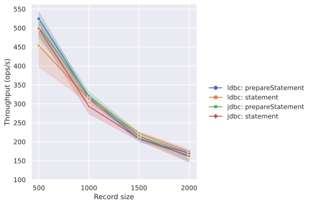
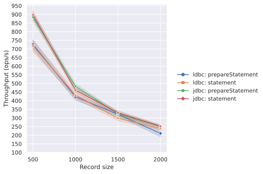
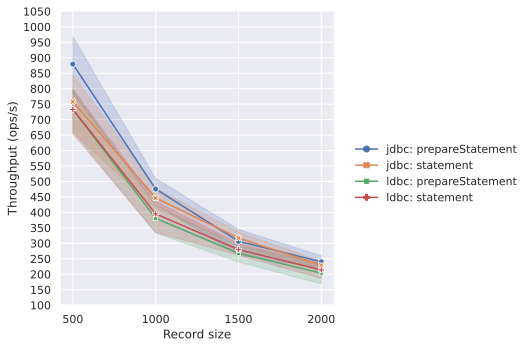
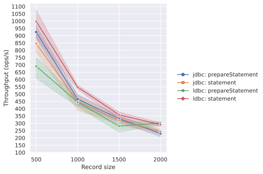



# Connection Pooling

## Overview

ldbc-connector is a library designed for Cats Effect that provides high-performance and safe database connection pooling. Unlike traditional JVM thread-based pooling (such as HikariCP), it is designed to fully utilize Cats Effect's fiber-based concurrency model.

@:callout(warning)

**Limitations with Scala Native 0.4.x**

The current Scala Native 0.4.x only supports single-threaded execution. Since the connection pooling functionality in ldbc-connector is designed with multi-threading in mind, when using it with Scala Native 0.4.x, the following issues may occur:

- Concurrent connection management does not work correctly
- Background tasks (HouseKeeper, AdaptivePoolSizer, etc.) may not execute as expected
- Concurrent connections are effectively limited to 1
- Deadlocks or unexpected behavior may occur

Scala Native 0.5.x is planned to support multi-threading, but until then, using connection pooling with Scala Native is not recommended. Instead, we recommend creating and using a new connection for each database operation.

@:@

## Architecture Overview



The ldbc-connector pooling system consists of the following main components:

### 1. PooledDataSource

The core component of the pool that manages the entire connection lifecycle.

Main responsibilities:
- Coordinating connection acquisition and release
- Managing pool size
- Collecting metrics
- Coordinating background tasks

### 2. ConcurrentBag

A high-performance concurrent data structure inspired by HikariCP's ConcurrentBag, but optimized for Cats Effect fibers rather than JVM threads.

Features:
- Lock-free operations
- Direct handoff between fibers
- Efficient wait queue management
- Atomic state management using `Ref[F]`

### 3. CircuitBreaker

A critical component for preventing the "Thundering Herd" problem when the database is down.

## CircuitBreaker Details

### State Transition Diagram



### Purpose of CircuitBreaker

The CircuitBreaker pattern is implemented to solve the following problems:

1. **Thundering Herd Problem Prevention**
   - Prevents situations where a large number of clients attempt to reconnect simultaneously after the database becomes temporarily unavailable
   - This avoids further increasing the load on an already struggling database

2. **Fail Fast**
   - When the database is unresponsive, new connection attempts fail immediately
   - This prevents clients from waiting for long timeouts

3. **Gradual Recovery**
   - Carefully tests whether the service has recovered through the Half-Open state
   - Exponential backoff gradually increases retry intervals for repeated failures

### Implementation Details

```scala
trait CircuitBreaker[F[_]]:
  def protect[A](action: F[A]): F[A]
  def state: F[CircuitBreaker.State]
  def reset: F[Unit]
```

Configuration parameters:
- `maxFailures`: Number of failures before transitioning to Open state (default: 5)
- `resetTimeout`: Time before transitioning from Open to Half-Open state (default: 60 seconds)
- `exponentialBackoffFactor`: Timeout increase factor on failure (default: 2.0)
- `maxResetTimeout`: Maximum reset timeout (default: 5 minutes)

### Operation Flow

1. **Closed State**
   - All requests are processed normally
   - Failures are counted, and the state transitions to Open when threshold is reached

2. **Open State**
   - All requests fail immediately (fail fast)
   - After reset timeout elapses, attempts to transition to Half-Open state

3. **Half-Open State**
   - Allows a single test request
   - On success: Returns to Closed state
   - On failure: Returns to Open state with exponentially increased timeout

## JVM Threads vs Cats Effect Fibers

### Differences and Characteristics of Concurrency Models


#### JVM Thread Characteristics (HikariCP, etc.)

**Advantages:**
- **OS-level support**: Preemptive scheduling
- **Existing ecosystem**: Many libraries and tools support
- **Debug tools**: Mature profiling and monitoring tools
- **Simple execution model**: Easy-to-understand execution flow

**Limitations:**
- **Memory usage**: 1-2MB per thread
- **Context switching**: High cost at kernel level
- **Scalability**: Practical limit of thousands of threads
- **Blocking**: Threads actually block

#### Cats Effect Fiber Characteristics (ldbc-connector)

**Advantages:**
- **Memory efficiency**: ~150 bytes per fiber
- **Lightweight context switching**: User-space switching
- **High scalability**: Millions of fibers possible
- **Semantic blocking**: Worker threads are released

**Limitations:**
- **Cooperative scheduling**: Requires explicit yield points
- **Learning curve**: Requires functional programming knowledge
- **Ecosystem**: Limited supporting libraries
- **Debug complexity**: Difficult to trace asynchronous execution flow

### Impact on Pooling Design

The characteristics of each concurrency model lead to different pooling implementation approaches:

#### Thread-based Pool (HikariCP style)
- **Pool size**: Requires careful configuration due to OS resource constraints
- **Wait strategy**: Blocking wait, utilizing dedicated thread pools
- **Use cases**: CPU-intensive tasks, integration with legacy systems
- **Operations**: Easy management with existing monitoring tools

#### Fiber-based Pool (ldbc-connector)
- **Pool size**: Larger pool sizes possible
- **Wait strategy**: Non-blocking wait, efficient resource sharing
- **Use cases**: I/O-intensive tasks, environments requiring high concurrency
- **Operations**: Requires Cats Effect-compatible monitoring and management

## Comparison with HikariCP

### Similarities

- Performance-focused design
- Lock-free data structures like ConcurrentBag
- Connection management using proxy pattern
- Automatic pool size adjustment

### Differences

| Feature             | HikariCP                  | ldbc-connector             |
|---------------------|---------------------------|----------------------------|
| Concurrency Model   | JVM Threads               | Cats Effect Fibers         |
| Blocking Handling   | Blocks threads            | Semantic blocking          |
| Scalability         | Limited by thread count   | Virtually unlimited fibers |
| CircuitBreaker      | Requires external library | Built-in                   |
| Error Handling      | Exception-based           | Functional                 |
| Resource Management | try-with-resources        | Resource                   |

### Usage Scenarios and Selection Criteria

#### When ldbc-connector is suitable:

1. **High Concurrency Environments**
   - Thousands of concurrent connection requests
   - Microservice architectures
   - Reactive applications

2. **I/O-Bound Workloads**
   - Long-running queries
   - Simultaneous access to multiple databases
   - Asynchronous processing pipelines

3. **Cats Effect Ecosystem**
   - Already using Cats Effect
   - Adopting functional programming approach
   - Type safety-focused environments

#### When thread-based pools like HikariCP are suitable:

1. **Integration with Existing Systems**
   - Legacy applications
   - Traditional frameworks like Spring Framework
   - Compatibility with JDBC-compliant tools

2. **Operational Considerations**
   - Utilizing existing monitoring and management tools
   - Leveraging existing team knowledge
   - Proven, stable implementation

3. **Simple Concurrency Requirements**
   - Moderate concurrent connection counts
   - Predictable workloads
   - CPU-intensive processing

## Background Tasks

ldbc-connector runs multiple background tasks to maintain pool health:

### HouseKeeper
- Removes expired connections
- Handles idle timeout
- Maintains minimum connection count

### AdaptivePoolSizer
- Dynamically adjusts pool size based on utilization metrics
- Scales up and down based on load
- Stabilization through cooldown periods

### KeepaliveExecutor
- Periodically validates idle connections
- Maintains connections and prevents timeouts

## Configuration Examples

### Basic Usage

```scala 3
import cats.effect.IO
import ldbc.connector.*
import scala.concurrent.duration.*

// Pool configuration
val config = MySQLConfig.default
  .setHost("localhost")
  .setPort(3306)
  .setUser("myuser")
  .setPassword("mypassword")
  .setDatabase("mydb")
  // Pool size settings
  .setMinConnections(5)           // Minimum connections (default: 5)
  .setMaxConnections(20)          // Maximum connections (default: 10)
  // Timeout settings
  .setConnectionTimeout(30.seconds)    // Connection acquisition timeout (default: 30s)
  .setIdleTimeout(10.minutes)         // Idle timeout (default: 10min)
  .setMaxLifetime(30.minutes)         // Maximum lifetime (default: 30min)
  .setValidationTimeout(5.seconds)    // Validation timeout (default: 5s)
  // Validation & Health checks
  .setAliveBypassWindow(500.millis)   // Skip validation if used recently (default: 500ms)
  .setKeepaliveTime(2.minutes)        // Idle validation interval (default: 2min)
  .setConnectionTestQuery("SELECT 1") // Custom test query (optional)
  // Leak detection
  .setLeakDetectionThreshold(2.minutes) // Connection leak detection (default: none)
  // Maintenance
  .setMaintenanceInterval(30.seconds)  // Background cleanup interval (default: 30s)
  // Adaptive sizing
  .setAdaptiveSizing(true)            // Dynamic pool size adjustment (default: false)
  .setAdaptiveInterval(1.minute)      // Adaptive sizing check interval (default: 1min)

// Create pooled datasource
val poolResource = MySQLDataSource.pooling[IO](config)

// Use the pool
poolResource.use { pool =>
  pool.getConnection.use { conn =>
    // Use connection
    for
      stmt <- conn.createStatement()
      rs   <- stmt.executeQuery("SELECT 1")
      _    <- rs.next()
      result <- rs.getInt(1)
    yield result
  }
}
```

### Pool with Metrics Tracking

```scala 3
import ldbc.connector.pool.*

val metricsResource = for
  tracker <- Resource.eval(PoolMetricsTracker.inMemory[IO])
  pool    <- MySQLDataSource.pooling[IO](
    config,
    metricsTracker = Some(tracker)
  )
yield (pool, tracker)

metricsResource.use { case (pool, tracker) =>
  // Use pool and monitor metrics
  for
    _       <- pool.getConnection.use(conn => /* use connection */ IO.unit)
    metrics <- tracker.getMetrics
    _       <- IO.println(s"Total acquisitions: ${metrics.totalAcquisitions}")
    _       <- IO.println(s"Average acquisition time: ${metrics.acquisitionTime}")
  yield ()
}
```

### Pool with Lifecycle Hooks

```scala 3
case class SessionContext(userId: String, startTime: Long)

val beforeHook: Connection[IO] => IO[SessionContext] = conn =>
  for
    _ <- conn.createStatement().flatMap(_.executeUpdate("SET SESSION sql_mode = 'STRICT_ALL_TABLES'"))
    startTime = System.currentTimeMillis
  yield SessionContext("user123", startTime)

val afterHook: (SessionContext, Connection[IO]) => IO[Unit] = (ctx, conn) =>
  IO.println(s"Connection used by ${ctx.userId} for ${System.currentTimeMillis - ctx.startTime}ms")

val poolWithHooks = MySQLDataSource.poolingWithBeforeAfter[IO, SessionContext](
  config = config,
  before = Some(beforeHook),
  after = Some(afterHook)
)
```

### CircuitBreaker Configuration

CircuitBreaker is configured automatically internally, with the following default values in the current implementation:

- `maxFailures`: 5 (threshold for transitioning to Open state)
- `resetTimeout`: 30 seconds (time before transitioning to Half-Open state)
- `exponentialBackoffFactor`: 2.0 (backoff factor)
- `maxResetTimeout`: 5 minutes (maximum reset timeout)

## Benchmark Results

The following shows benchmark results comparing the performance of ldbc-connector and HikariCP with different thread counts. The benchmark measures concurrent performance in executing SELECT statements.

### Test Environment
- Benchmark content: Concurrent execution of SELECT statements
- Test targets: ldbc-connector vs HikariCP
- Thread counts: 1, 2, 4, 8, 16

### Result Graphs

#### Thread Count: 1


#### Thread Count: 2


#### Thread Count: 4


#### Thread Count: 8


#### Thread Count: 16


### Analysis of Benchmark Results

The following trends can be observed from these benchmark results:

1. **Low Concurrency Environment (1-2 threads)**
   - Performance of both implementations shows relatively close values
   - The difference in overhead is small for simple workloads

2. **Medium Concurrency Environment (4-8 threads)**
   - As concurrency increases, the characteristics of each implementation begin to emerge
   - The impact of the fiber-based lightweight concurrency model can be observed

3. **High Concurrency Environment (16 threads)**
   - The behavioral differences between the two implementations become clear under high concurrency
   - Resource efficiency and scalability characteristics become prominent

### Performance Characteristics Discussion

The benchmark results reflect the inherent characteristics of each approach:

**ldbc-connector (Fiber-based)**
- Efficient resource utilization through lightweight concurrency primitives
- CPU usage optimization through semantic blocking
- Scalability under high concurrency

**HikariCP (Thread-based)**
- Stable performance from mature implementation
- Fairness through OS-level scheduling
- High compatibility with existing JVM toolchains

### Recommendations by Use Case

Recommendations based on benchmark results for different use cases:

1. **When low to moderate concurrency is required**
   - Both implementations provide sufficient performance
   - Choose based on existing infrastructure and team experience

2. **When high concurrency is required**
   - Consider application characteristics (I/O-centric vs CPU-centric)
   - Also consider operational requirements (monitoring, debugging, troubleshooting)

3. **For dynamic workloads**
   - Consider utilizing adaptive pool sizing
   - CircuitBreaker behavior during failures is also an important selection criterion

It's important to note that benchmark results are measurements under specific conditions, and actual application performance is influenced by many factors including workload characteristics, database configuration, and network environment. Testing with actual workloads is recommended before production deployment.

## Summary

The ldbc-connector pooling system is an implementation that leverages Cats Effect's concurrency model. By incorporating the CircuitBreaker pattern, it enhances resilience during database failures.

Fiber-based and thread-based approaches each have their strengths and weaknesses. It's important to make appropriate choices by comprehensively evaluating application requirements, existing infrastructure, team skill sets, and operational considerations.

ldbc-connector is a choice that can maximize its characteristics particularly in environments requiring high concurrency or when adopting the Cats Effect ecosystem.