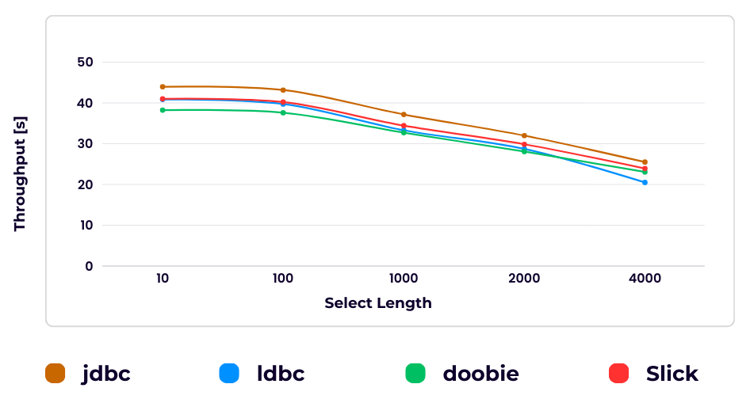
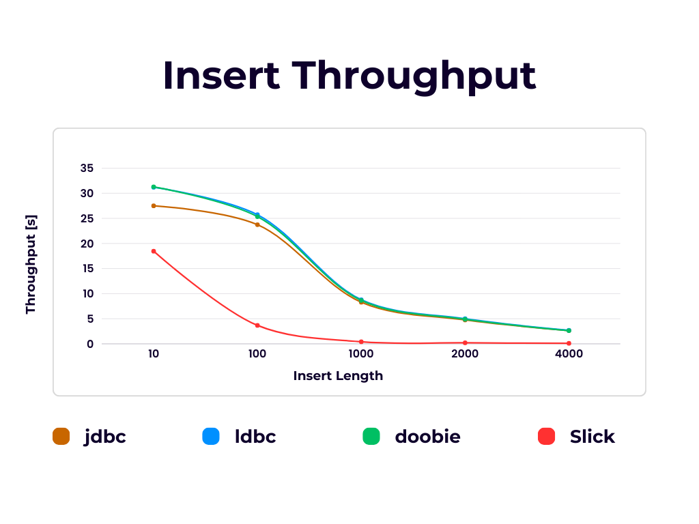

# パフォーマンス

## コンパイル時間のオーバーヘッド

テーブル定義のコンパイル時間はカラムの数に応じて増加する

クエリ構築のコンパイル時間はselectするカラム数に応じて増加する

## ランタイムのオーバーヘッド

ldbcは内部的にはTupleを使用しているので、純粋なクラス定義に比べてかなり遅くなってしまう。

ldbcはテーブル定義で他に比べてかなり遅くなってしまう。

## クエリ実行のオーバーヘッド

selectクエリの実行は取得するレコード数が増加するにつれてスループットは低くなる

insertクエリの実行は挿入するレコード数が増加するにつれてスループットは低くなる

※ 実行したクエリが完全に一致するものではないため正確ではない

