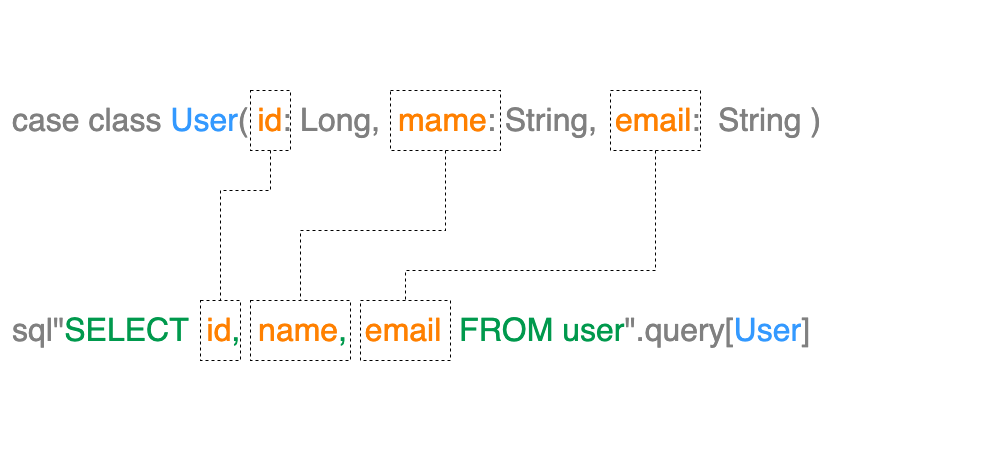
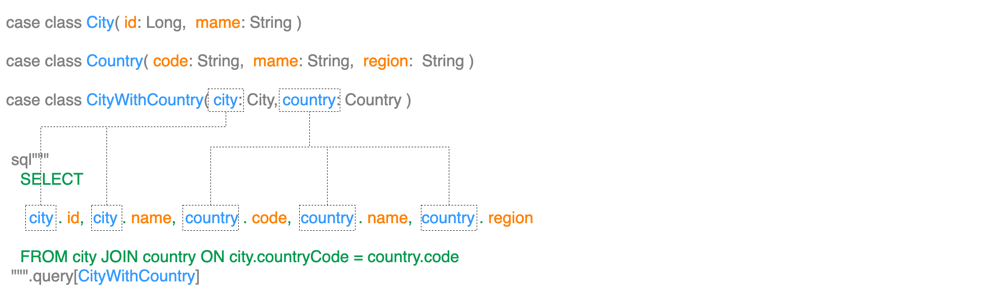



# データ選択

この章では、ldbcデータセットを使用してデータを選択する方法を説明します。

## コレクションへの行の読み込み

最初のクエリでは、低レベルのクエリを目指して、いくつかのユーザーをリストに選択し、最初の数件をプリントアウトしてみましょう。ここにはいくつかのステップがあるので、途中のタイプを記しておきます。

```scala
sql"SELECT name FROM user"
  .query[String] // Query[IO, String]
  .to[List] // Executor[IO, List[String]]
  .readOnly(conn) // IO[List[String]]
  .unsafeRunSync() // List[String]
  .foreach(println) // Unit
```

これを少し分解してみよう。

- `sql"SELECT name FROM user".query[String]`は`Query[IO, String]`を定義し、返される各行をStringにマップする1列のクエリです。このクエリは1列のクエリで、返される行をそれぞれStringにマップします。
- `.to[List]`は、行をリストに蓄積する便利なメソッドで、この場合は`Executor[IO, List[String]]`を生成します。このメソッドは、CanBuildFromを持つすべてのコレクション・タイプで動作します。
- `readOnly(conn)`は`IO[List[String]]`を生成し、これを実行すると通常のScala `List[String]`が出力される。
- `unsafeRunSync()`は、IOモナドを実行し、結果を取得する。これは、IOモナドを実行し、結果を取得するために使用される。
- `foreach(println)`は、リストの各要素をプリントアウトする。

## 複数列クエリ

もちろん、複数のカラムを選択してタプルにマッピングすることもできます。

```scala
sql"SELECT name, email FROM user"
  .query[(String, String)] // Query[IO, (String, String)]
  .to[List] // Executor[IO, List[(String, String)]]
  .readOnly(conn) // IO[List[(String, String)]]
  .unsafeRunSync() // List[(String, String)]
  .foreach(println) // Unit
```

## クラスへのマッピング

ldbcは、複数のカラムを選択してクラスにマッピングすることもできます。これは、`User`クラスを定義して、クエリの結果を`User`クラスにマッピングする例です。

```scala 3
case class User(id: Long, name: String, email: String)

sql"SELECT id, name, email FROM user"
  .query[User] // Query[IO, User]
  .to[List] // Executor[IO, List[User]]
  .readOnly(conn) // IO[List[User]]
  .unsafeRunSync() // List[User]
  .foreach(println) // Unit
```

クラスのフィールドは、クエリのカラム名と一致する必要があります。これは、`User`クラスのフィールドが`id`、`name`、`email`であるため、クエリのカラム名が`id`、`name`、`email`であることを意味します。



`Join`などを使用して複数のテーブルからデータを選択する方法を見てみましょう。

これは、`City`, `Country`, `CityWithCountry`クラスそれぞれを定義して、`city`と`country`テーブルを`Join`したクエリの結果を`CityWithCountry`クラスにマッピングする例です。

```scala 3
case class City(id: Long, name: String)
case class Country(code: String, name: String, region: String)
case class CityWithCountry(coty: City, country: Country)

sql"""
  SELECT
    city.id,
    city.name,
    country.code,
    country.name,
    country.region
  FROM city
  JOIN country ON city.country_code = country.code
"""
  .query[CityWithCountry] // Query[IO, CityWithCountry]
  .to[List] // Executor[IO, List[CityWithCountry]]
  .readOnly(conn) // IO[List[CityWithCountry]]
  .unsafeRunSync() // List[CityWithCountry]
  .foreach(println) // Unit
```

クラスのフィールドは、クエリのカラム名と一致する必要があると先ほど述べました。
この場合、`City`クラスのフィールドが`id`、`name`であり、`Country`クラスのフィールドが`code`、`name`、`region`であるため、クエリのカラム名が`id`、`name`、`code`、`name`、`region`であることを意味します。

`Join`を行った場合、それぞれのカラムはテーブル名と共に指定しどのテーブルのカラムかを明示する必要があります。 
この例では、`city.id`、`city.name`、`country.code`、`country.name`、`country.region`として指定しています。

ldbcではこのように`テーブル名`.`カラム名`を`クラス名`.`フィールド名`にマッピングすることによって、複数のテーブルから取得したデータをネストしたクラスにマッピングすることができます。



ldbcでは`Join`を行い複数のテーブルからデータを取得する際に、単体のクラスのみではなくクラスの`Tuple`にマッピングすることもできます。

```scala 3
case class City(id: Long, name: String)
case class Country(code: String, name: String, region: String)

sql"""
  SELECT
    city.id,
    city.name,
    country.code,
    country.name,
    country.region
  FROM city
  JOIN country ON city.country_code = country.code
"""
  .query[(City, Country)]
  .to[List]
  .readOnly(conn)
  .unsafeRunSync()
  .foreach(println)
```

この例では、`City`クラスと`Country`クラスを`Tuple`にマッピングしています。

ここで注意したいのが、先ほどと異なり`テーブル名`.`カラム名`を`クラス名`.`フィールド名`にマッピングすること際にテーブル名はクラス名を使用しています。

そのため、このマッピングには制約がありテーブル名とクラス名は等価でなければいけません。つまり、エイリアスなどを使ってテーブル名を`city`から`c`などに短縮した場合、クラス名も`C`でなければならない。

```scala 3
case class C(id: Long, name: String)
case class CT(code: String, name: String, region: String)

sql"""
  SELECT
    c.id,
    c.name,
    ct.code,
    ct.name,
    ct.region
  FROM city AS c
  JOIN country AS ct ON c.country_code = ct.code
"""
  .query[(City, Country)]
  .to[List]
  .readOnly(conn)
  .unsafeRunSync()
  .foreach(println)
```
