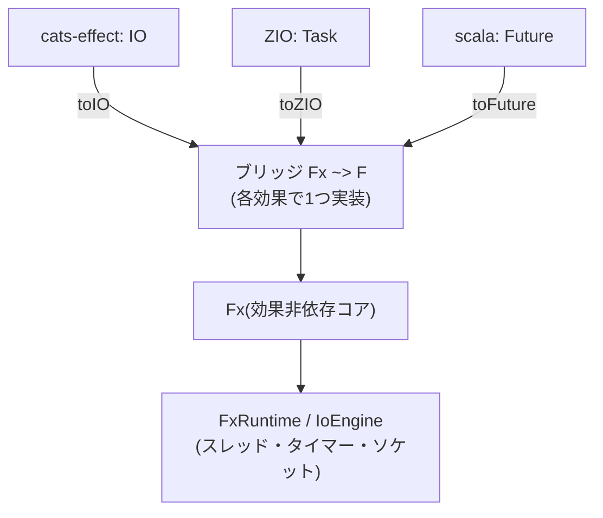
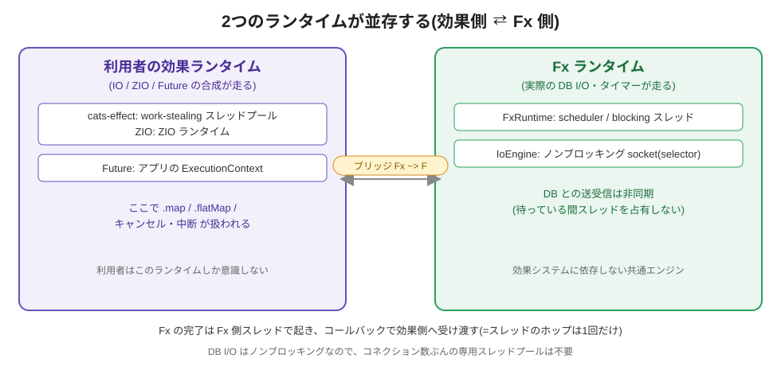
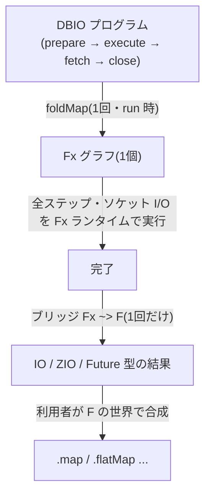
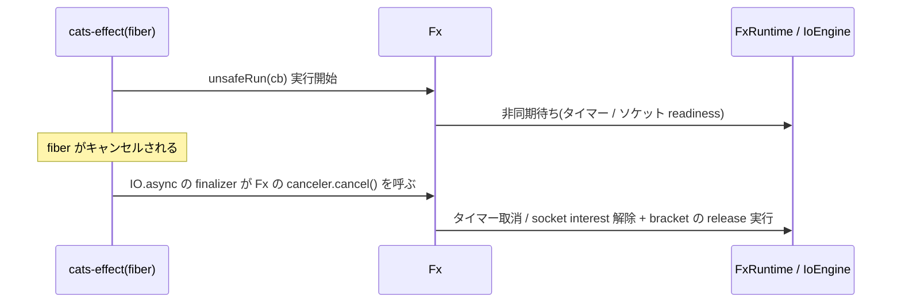
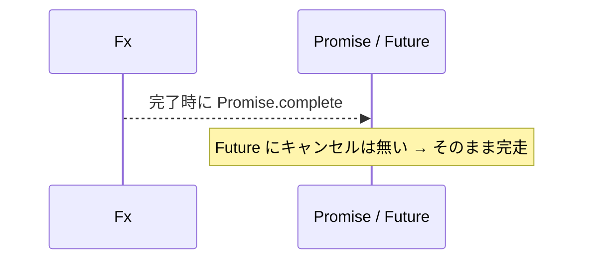
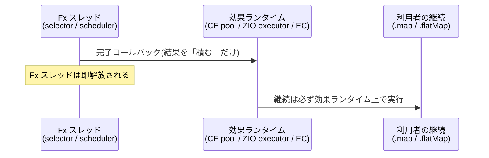

# Fx を CE / ZIO / Future から使うとき

このドキュメントは、内部エンジン `Fx`(と [`FxRuntime`](./FxRuntime.md))が、**cats-effect(IO)・ZIO・Future** の3つの効果システムから使われるときに、**スレッド・ランタイム・キャンセルがどう連携するか**を、初心者にも分かるように図で説明します。

> 前提: `FxRuntime` 単体の仕組み(JVM/JS/Native のスレッド)は [FxRuntime.md](./FxRuntime.md) を先に読むと分かりやすいです。

---

## 0. ひとことで

- **`Fx` は「エンジン」**、**CE / ZIO / Future は「運転席(窓口)」**。
- 利用者は**自分がふだん使う効果システム**(IO / ZIO / Future)でコードを書く。
- その裏で `Fx` が実際の DB I/O を動かし、結果を窓口へ返す。
- **1つの効果非依存プログラムが、CE でも ZIO でも Future でも同じように動く**。



---

## 1. ブリッジの仕組み(`Fx ~> F`)

各効果システムは「`Fx` を1回包む」だけです。中身はとても短いです。

| 効果 | 包み方 | キャンセルの扱い |
|---|---|---|
| **cats-effect** | `IO.async`(finalizer に Fx の canceler を渡す) | IO のキャンセルが Fx を中断 |
| **ZIO** | `ZIO.asyncInterrupt`(canceler を返す) | ZIO の中断(interrupt)が Fx を中断 |
| **Future** | `Promise` に結果を入れる | **キャンセルなし**(Future 本来の性質) |

```scala
// cats-effect
def toIO[A](fx: Fx[A]): IO[A] =
  IO.async[A] { cb => IO { val c = fx.unsafeRun(cb); Some(IO(c.cancel())) } }

// ZIO
def toZIO[A](fx: Fx[A]): Task[A] =
  ZIO.asyncInterrupt[Any, Throwable, A] { k =>
    val c = fx.unsafeRun(r => k(ZIO.fromEither(r)))
    Left(ZIO.succeed(c.cancel()))
  }

// Future
def toFuture[A](fx: Fx[A]): Future[A] =
  val p = Promise[A](); fx.unsafeRun(r => p.complete(r.toTry)); p.future
```

---

## 2. 2つのランタイムが「並存」する

ここが一番大事な概念です。効果システムを使うと、**ランタイム(スレッドの集まり)が2つ同時に存在**します。



- **左:利用者の効果ランタイム** — `IO`/`ZIO`/`Future` の合成(`.map`/`.flatMap`)やキャンセルを扱う。
  - cats-effect: work-stealing スレッドプール / ZIO: ZIO ランタイム / Future: アプリの `ExecutionContext`
- **右:Fx ランタイム** — 実際の DB 送受信やタイマーを動かす([`FxRuntime`](./FxRuntime.md) のスレッド + `IoEngine` の selector スレッド)。

**受け渡しはコールバック1回**:`Fx` の処理が終わると、Fx 側スレッドで完了コールバックが呼ばれ、そこで効果側(IO の完了 / Promise の complete)へ渡されます。つまり**スレッドのホップは1回だけ**で、無駄がありません。

> 重要: DB I/O は**ノンブロッキング**なので、Fx 側は「クエリ1件ごとにスレッドを1本占有」しません。だから**コネクション数に比例した専用スレッドプールは不要**です(JDBC を使う従来型との大きな違い)。

---

## 3. 変換はいつ起きる?(`run` 単位で1回だけ)

方向は **「Fx → F」**(Fx を、あなたの効果 IO / ZIO / Future に変換して返す)で、これは **`run` 1回につき1回**だけ起きます。**操作ごと・行ごとには起きません**。ここが overhead の有無の分かれ目です。



- 1つの DBIO(中で prepare / execute / fetch / close など複数操作)は、**まるごと1つの `Fx` グラフ**に畳まれる。
- その `Fx` は**中の全ステップ(socket 送受信含む)を Fx 側で実行**しきる。
- **効果側(IO / ZIO / Future)に渡すのは、最後の結果1回だけ**。

```scala
def run[A](dbio: DBIO[A]): F[A] = bridge( dbio.foldMap(interpreterToFx) )
//                                  ↑ Fx ~> F は1回     ↑ DBIO 全体 → Fx 1個
```

**overhead は「クエリ1件あたり O(1)」**:10操作のクエリでも Fx 側で10操作を実行し、最後に **1回だけ**効果へ渡す。操作/行ごとの変換は発生しない。

> 例外: ストリーミング(1行ずつ pull)だけは、各 pull を `fs2.Stream` / `ZStream` にマップするため取得ごとに1回ブリッジが挟まる(1 pull = async 1回で軽い)。v1 の materialize(全件取得)なら「クエリ1回 = 変換1回」。

---

## 4. キャンセル・中断はどう伝わるか

「各効果の特性を壊さない」= **効果側のキャンセルが、ちゃんと Fx 側(タイマー取消・ソケット解除・リソース解放)まで届く**、ということ。

### cats-effect(IO):キャンセルが本物



#### キャンセル時の finalizer 実行の保証(CE / ZIO と同一)

**`bracket` の `release`(finalizer)は、`use` と決して並行に走りません。** これは cats-effect と ZIO が保証している安全性の性質で、Fx も同じ挙動に揃えてあります。具体的には、`cancel()` が呼ばれても:

- **run ループが同期領域(`Fx.delay` の計算など)を実行中**なら、`cancel()` は「中断要求フラグ」を立てるだけで、finalizer はループ自身が次の中断ポイントに達してから**同じスレッドで**実行します。
- **`Fx.blocking` / `Fx.interruptible` の thunk が実行中**なら、その完了(または割り込み)を待ってから finalizer を実行します。

この保証がないと、例えば Native TLS の `release`(s2n のネイティブメモリ解放)が、実行中の `s2n_recv` と並行して走り **use-after-free** を起こしえます。「finalizer は use が止まった後に走る」ことでこれを構造的に防いでいます。

> 帰結: **キャンセルされた `Fx.blocking` は、その同期処理が自然に完了するまで待ってから解放されます**(CE の `blocking` と同じ)。ブロッキング処理そのものを途中で止めたい場合は、下記の `Fx.interruptible`(スレッド割り込み)か、非同期 I/O(JVM NIO エンジン)を使います。

### ZIO(Task):中断が本物

`ZIO.asyncInterrupt` の「canceler」に Fx の canceler をつなぐので、**ZIO の中断がそのまま Fx を止めます**。しかも **cats-effect を経由しない**ので、従来の `zio-interop-cats` 経由より無駄がありません。

### Future:キャンセルなし(それが正しい姿)



Future は言語仕様としてキャンセルを持ちません。だから「キャンセルできない」のは**壊れているのではなく Future 本来の挙動**です。

---

## 4.5. キャンセルまわりの公開 API と並行プリミティブ

Fx は「効果非依存コア」に必要な最小限の道具だけを持ちます。キャンセル制御と並行制御に関わる公開 API は以下です。

| API | 何をするか | いつ使うか |
|---|---|---|
| `Fx.uncancelable(body)` | `body` を**中断不可(マスク)領域**として実行。マスク中は `cancel()` が来ても finalizer を流さず、領域を抜けてから処理する | 「取得と finalizer 登録」を不可分にしたい所。`bracket` の acquire はこれで保護され、**キャンセルによるリソース漏れが起きない** |
| `Fx.interruptible(thunk)` | ブロッキング同期処理を**割り込み可能**に実行。JVM/Native は専用デーモンスレッドで走らせ、`cancel()` は `Thread.interrupt()` を呼ぶ(JS は割り込み不可のため `Fx.blocking` と同等) | `InterruptedException` に反応する処理(`Thread.sleep`、一部の I/O)を途中で止めたいとき。**opt-in**(既定の `Fx.blocking` は割り込まない) |
| `Fx.bracket(acquire)(use)(release)` | 取得・使用・解放。acquire は uncancelable、release は上記の保証(use と非並行)で必ず実行 | リソース安全な取得/解放全般 |

### 並行プリミティブ(`Ref` / `Deferred` / `Mutex`)

`Async` に依存せず全プラットフォームで動く、`AtomicReference` ベースのロックフリー実装です。

| 型 | 役割 | 対応する CE 型 |
|---|---|---|
| `Ref[A]` | 原子的に更新できる可変セル | `cats.effect.Ref` |
| `Deferred[A]` | 一度だけ書ける非同期の値(待ち合わせ) | `cats.effect.Deferred` |
| `Mutex` | 公平(FIFO)な相互排他ロック。`surround(fa)` で `fa` をロック下で実行(エラー/キャンセル時も `bracket` で必ず解放) | `cats.effect.std.Mutex` |

> `Mutex` は `ldbc-net` の `Socket` が「同一方向の read / write を重複させない」ことを**構造的に強制**するために使われます(fs2 の socket と同じく read 用・write 用の2本)。`surround` の acquire は `uncancelable` なので、キャンセルによるロック漏れは起きません。

---

## 5. どのスレッドで何が起きる?(まとめ)

| 段階 | 走る場所 |
|---|---|
| `IO`/`ZIO`/`Future` の組み立て(`for` / `.flatMap`) | 利用者の効果ランタイム |
| 実際の DB 送受信・`sleep` | **Fx ランタイム**(IoEngine の selector スレッド、`FxRuntime` のスレッド) |
| 完了コールバック(結果を効果側へ渡す) | Fx 側スレッド → 効果側へ**1ホップ** |
| 完了後の `.map` / `.flatMap` | 利用者の効果ランタイム |
| キャンセル/中断 | 効果側で発火 → Fx の canceler → Fx ランタイムで取消・解放 |

---

## 6. 各効果で「特性」は保たれるか(結論)

| 効果 | 保たれる特性 | 補足 |
|---|---|---|
| cats-effect | キャンセル・リソース安全・fiber | `IO.async` の finalizer に配線 |
| ZIO | 中断(interruption) | `zio-interop-cats` を挟まない → 純度・性能↑ |
| Future | Future ネイティブ | キャンセル無しは本来の姿 |

- **性能**:ブリッジは各ランタイムの通常経路そのもの(ボクシングや異種効果変換なし)→ **アダプタ層はほぼゼロ overhead**。性能は Fx 側 I/O エンジンの質で決まる。
- **専用 DB スレッドプール不要**:ノンブロッキングなので、Slick/doobie(JDBC)で必要だった「プールサイズ分のスレッド」が要らない。

---

## 7. パフォーマンス — 変換のオーバーヘッド実測

「Fx 経由(`toIO` / `toZIO` / `toFuture`)」と「純粋な CE / ZIO / Future」を JMH で比較しました(Throughput = ops/s、**高いほど速い**)。

| ワークロード | ネイティブ | Fx 経由 | 判定 |
|---|---|---|---|
| IO: flatMap × 100 | 約 112k ops/s | 約 118k ops/s | **同等**(誤差内) |
| IO: async 1回 | 約 140k | 約 153k | **同等**(`unsafeRunSync` が支配) |
| ZIO: flatMap × 100 | 約 596k | 約 499k | **同等**(誤差大で有意差なし) |
| ZIO: async 1回 | 約 9.3M(107ns/op) | 約 5.6M(177ns/op) | Fx 経由が **+約70ns** |
| Future: flatMap × 100 | 約 33k | 約 641k | **Fx 経由が約19倍速い** |

**結論**:

- **Fx → CE / ZIO / Future の変換による意味のある性能劣化は無い。**
- 唯一測定できた差(ZIO の async 1回の **+約70ns/op**)は、**DB の実 I/O(ネットワーク往復 = 数十µs〜ミリ秒)の1万分の1以下**で、実クエリでは無視できる。差の内訳は `Fx.async` の call-once ガード(Atomic CAS)+ `asyncInterrupt` ラップ分。
- **Future はむしろ大幅に速い**:純 `Future` は `flatMap` ごとに `ExecutionContext` へスケジューリングするが、Fx は同期 trampoline で畳んで `Promise` を1回だけ完了するため。
- 実性能は「変換の有無」ではなく **I/O エンジン(`IoEngine`)の質**で決まる。

> 補足: これは合成マイクロベンチで、絶対値は ns〜µs スケール(誤差あり)。細かい比率は当てにならないが、「変換 overhead は DB I/O より桁違いに小さい」という結論は堅牢。計測条件: JMH Throughput、warmup 3 × measurement 4、fork 1。

---

## 8. Fx が「独自スレッド」で完了を通知して大丈夫?

よくある不安:「`Fx` は自前のスレッド(`FxRuntime` の scheduler / blocking、`IoEngine` の selector)を持ち、**そのスレッドから完了コールバックを呼ぶ**。効果システムから見て問題にならない?」

**結論:問題ありません。**「コールバックが任意スレッドから呼ばれ、継続は効果システム自身のランタイムで走る」ことは、**CE / ZIO / Future の3つとも公式に設計・保証しているパターン**です(コールバックベース API の統合はこのために存在します)。

### 各効果の「外部スレッド完了」の扱い(実装ソース根拠)

| 効果 | 外部スレッド完了時の動き | 根拠(実装) |
|---|---|---|
| **cats-effect** | fiber を **自分の compute pool に載せ直す**。継続は CE の work-stealing プールで走る | `IOFiber` の `scheduleFiber(ec, this)` / **`scheduleOnForeignEC(ec, this)`**(名前どおり「外部 EC からの再開」を明示処理) |
| **ZIO** | **スレッドセーフなメッセージ送信**で fiber を再開。継続は ZIO の executor で走る | `FiberRuntime` の `tell(FiberMessage.Resume(effect))`(`tell` は任意スレッドから呼べる) |
| **Future** | `Promise.complete` は**スレッドセーフ**。登録済み `.map`/`.flatMap` は**紐づけた `ExecutionContext`** で走る | Scala 標準仕様(`Promise`/`Future`) |



**要点:Fx スレッドは「結果を届ける(キューに積む)」だけで即解放**。利用者の後続処理(`.flatMap` 以降)は**必ず効果システム自身のランタイム**で走ります。fs2-io / http4s client など、コールバックベースの非同期 I/O を統合する既存ライブラリと**まったく同じ方式**です。

### 留意点(“無害だが設計上メモすべき”隣接論点 — 正しさの問題ではない)

| 論点 | 実態 / 対応 |
|---|---|
| スレッド/プールが2系統並存(Fx + 効果ランタイム) | 資源のわずかな重複のみ。正しさの問題ではない。将来 frontend の executor を注入して共有する最適化は可能 |
| Native のスレッド確保 | **対応済み**。SN 0.5 の javalib が `java.util.concurrent.Executors` をフル提供するため、JVM と同一の「スケジューラ1本 + キャッシュプール」方式でスレッドを再利用(操作ごとの生成はしない) |
| `IoEngine` の I/O スレッドが Fx 継続を inline 実行 | **実測で確認済み**(`PollerStarvationTest`): parked read の完了継続は、JVM=selector スレッド(`fx-io-engine`)/ Native=poller スレッド(`fx-net-poller`)上で走る(submitting スレッドではない)。単一 I/O スレッド設計なので、そこで長い継続を回すと他接続の readiness 処理が止まりうる。**→ 対策実装済み(auto-cede)**: `Fx.run` は **`autoCedeThreshold`(既定 1024)回連続で suspend せず回ると、残りの継続を `FxRuntime.executeCompute`(compute プール `fx-compute`)へ移して I/O スレッドを解放**する(`FxAutoCedeTest` / `PollerStarvationTest`「long read continuation ended on fx-compute」で両プラットフォーム実証)。短い継続(<1024 step)は inline のまま=無コスト。**限界(正直な注記)**: auto-cede は**長いチェーン**にしか効かない。**単一の重い同期 thunk**(`Fx.delay { 500ms の CPU }` は 1 step)は offload されず I/O スレッドを占有する → そのような処理は **`Fx.blocking` / `Fx.interruptible`** を使う(別スレッドで実行)。多接続の同時律速は poller のコアシャーディング(`IOENGINE_MULTICORE_SCALING.md`)で別途対応。**エンジン差**: JVM の read は常に selector 経由。Native の read は **eager `recv`** のため応答が既にバッファにあれば I/O スレッドを介さず submitting スレッドで完了(追加の緩和)。 |
| CE の starvation checker(compute pool のブロック検出) | Fx は**自分のスレッド**で動くので CE の compute pool をブロックせず、checker を誤発火させない(CE スレッド上で走るのは `unsafeRun` の軽い同期先頭部だけで、すぐ `async` で手を離す) |

---

## 参考

- ブリッジ設計の詳細: リポジトリ直下 `CORE_BOUNDARY_DESIGN.md`(§2 境界①)
- `FxRuntime` の内部: [FxRuntime.md](./FxRuntime.md)
- 実装: `module/ldbc-fx/shared/src/main/scala/ldbc/fx/Fx.scala`(ブリッジ本体は将来の `ldbc-cats` / `ldbc-zio` / `ldbc-future` モジュール)
