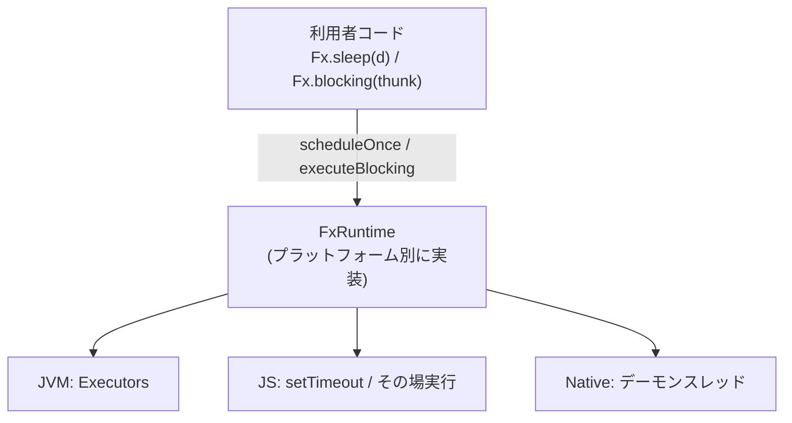
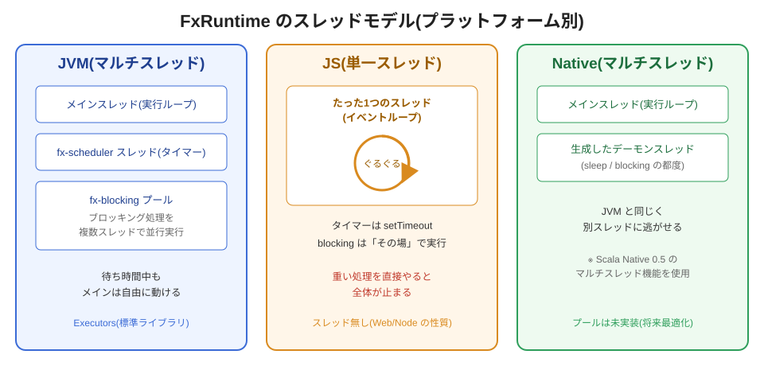
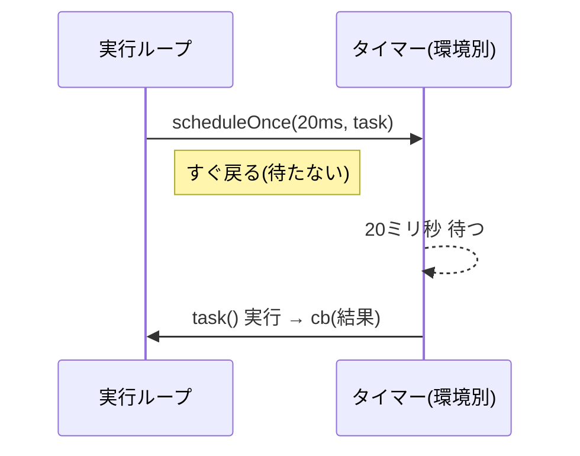
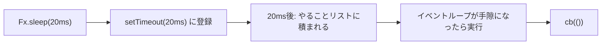
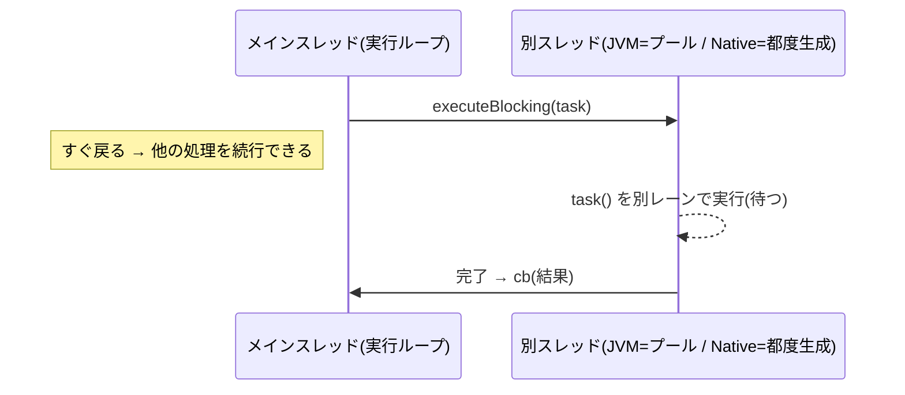
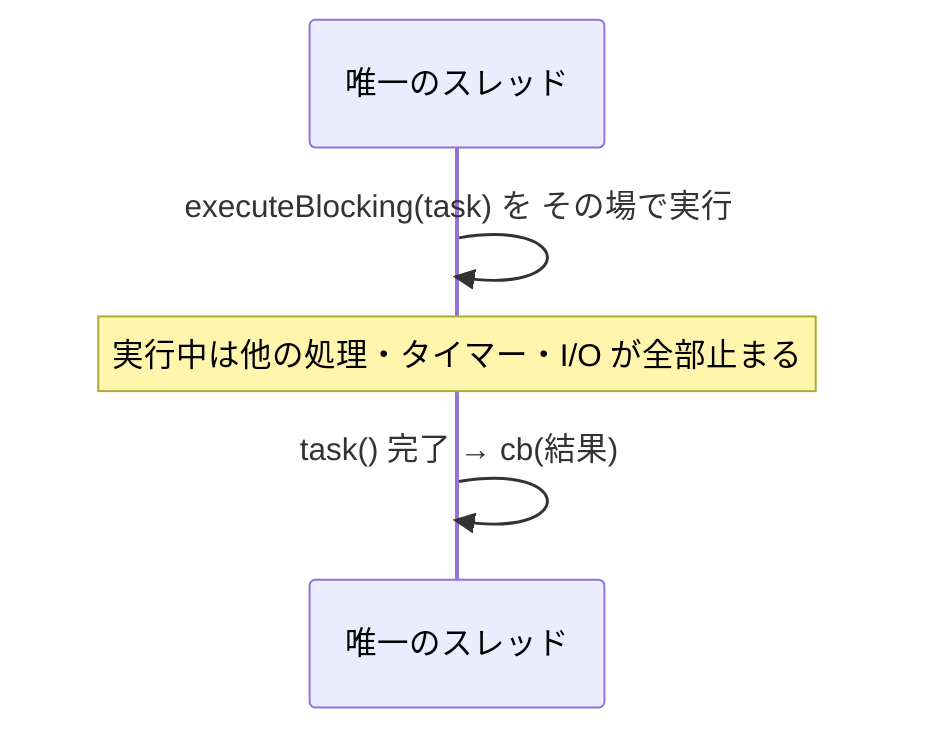
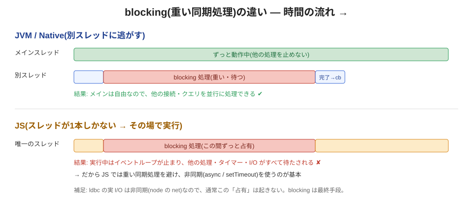

# FxRuntime の仕組み — JVM / JS / Native の違い

このドキュメントは、`ldbc-fx` の内部部品 **`FxRuntime`** が、JVM・JavaScript(JS)・Scala Native(Native)の3つの環境でどう動くかを、**プログラミング初心者にも分かるように**図を交えて説明します。

---

## 0. まず「言葉」から(前提知識)

| 用語 | かんたんな意味 |
|---|---|
| **スレッド** | 処理を実行する「作業レーン」。複数あれば同時並行に作業できる。 |
| **ブロッキング(blocking)** | 処理が終わるまでそのレーンを**占有して待つ**こと。待っている間そのレーンは他の仕事ができない。 |
| **イベントループ** | 「やることリスト」を1本のレーンでぐるぐる回して順番にこなす仕組み(JS が採用)。 |
| **デーモンスレッド** | メインの処理が終わったら**一緒に自動終了する**補助スレッド。後片付けが要らない。 |
| **タイマー** | 「◯ミリ秒後にこれを実行して」と予約する仕組み。 |

ポイントは **「レーン(スレッド)が何本あるか」**。ここがプラットフォームで決定的に違います。

---

## 1. FxRuntime とは(役割)

`Fx` は ldbc の内部の「処理の設計図」型です。その中で、**時間や外部リソースが絡む2種類の操作**だけは、環境ごとに実装が違います。それを担当するのが `FxRuntime` です。

| 操作 | 何をする | 使う `Fx` の入口 |
|---|---|---|
| `scheduleOnce(遅延, task)` | 指定時間**後に一度だけ** `task` を実行(タイマー) | `Fx.sleep(d)` |
| `executeBlocking(task)` | **重い同期処理**を(できれば別レーンで)実行 | `Fx.blocking(...)` |
| `executeInterruptible(task)` | **割り込み可能な**同期処理を実行。返す canceler が `Thread.interrupt()` を呼ぶ | `Fx.interruptible(...)` |
| `executeCompute(task)` | 継続を **compute プール(`fx-compute`)へ再スケジュール**。run ループの auto-cede が長い同期チェーンを現スレッド(I/O poller 等)から退避するのに使う。JS は `setTimeout(0)`(イベントループへ譲る) | `Fx.run` の auto-cede(内部) |

**利用者はこの違いを意識しません。** `Fx.sleep` / `Fx.blocking` と書けば、動いている環境に合った実装が自動で選ばれます。

---

## 2. 3プラットフォームのスレッドモデル(全体像)

- **JVM**: レーンがたくさん作れる。タイマー用スレッドと、ブロッキング用のスレッドプールを持つ。
- **JS**: レーンが**1本だけ**。タイマーは `setTimeout`、ブロッキングは「その場」で実行するしかない。
- **Native**: JVM 同様レーンを作れる(Scala Native 0.5 のマルチスレッド機能)。都度デーモンスレッドを起こす。

---

## 3. `scheduleOnce`(= `Fx.sleep`)の動き

### 共通の約束(どの環境でも同じ意味)

「◯ミリ秒**後に** `task` を1回実行する。呼んだ側は**待たずにすぐ戻る**(ノンブロッキング)。返り値の canceler で予約を取り消せる」。

### 環境別の実装

- **JVM**: `ScheduledExecutorService`(`fx-scheduler` という専用スレッド)が時間を計り、時間が来たら `task` を実行。
- **Native**: 専用のデーモンスレッドを起こして `Thread.sleep` で待ち、時間が来たら `task` を実行。取り消しはスレッドの `interrupt` で行う。
- **JS**: `setTimeout` に登録するだけ。時間が来るとコールバックが「やることリスト」に積まれ、イベントループが順番に実行する。

> JS はレーンが1本なので、「20ms後**ちょうど**」ではなく「20ms後、**手が空いたら**」実行される点だけ注意(通常は誤差程度)。

---

## 4. `executeBlocking`(= `Fx.blocking`)の動き — ここが一番の違い

`Fx.blocking` は「終わるまで待つタイプの重い同期処理」を実行するためのものです(例: 一部の同期ライブラリ呼び出し)。**問題は「待っている間、他の仕事を止めないか」**です。

### JVM / Native:別レーンに逃がす → メインは自由

### JS:レーンが1本 → その場で実行(占有する)

### 時間の流れで比べると

- **JVM / Native**: ブロッキングは別レーン。メインは自由なので、他の接続やクエリを**並行に**処理できる ✔
- **JS**: ブロッキングは唯一のレーンを占有。実行中は**全部が待たされる** ✘

> **だから設計上、JS では重い同期処理を避けます。** ldbc の実 I/O は非同期(node の `net`)なので、通常この占有は起きません。`Fx.blocking` は最終手段です。

### 割り込み可能版:`executeInterruptible`(= `Fx.interruptible`)

`Fx.blocking` は「完了するまで待つ」ため、キャンセルされても**同期処理そのものは止まりません**(その完了後に解放が走る)。`Thread.interrupt()` に反応する処理(`Thread.sleep` や割り込み対応 I/O)を**途中で止めたい**ときは、opt-in の `Fx.interruptible` を使います。

| 環境 | 実装 | `cancel()` の効果 |
|---|---|---|
| **JVM / Native** | 専用デーモンスレッド(`fx-interruptible`)で `task` を実行 | そのスレッドの `Thread.interrupt()` を呼ぶ → `InterruptedException` で処理が中断 |
| **JS** | レーンが1本なので割り込めない → その場実行(`Fx.blocking` と同等) | 何もしない(割り込み不可) |

> 既定の `Fx.blocking` を割り込み可能にしなかったのは、多くの同期処理が割り込みに正しく対応しておらず、中途半端な中断が状態を壊しうるためです。だから **opt-in**(明示的に `interruptible` を選ぶ)にしています。

---

## 5. 3プラットフォーム比較まとめ

| 観点 | JVM | JS | Native |
|---|---|---|---|
| レーン(スレッド) | 複数 | **1本のみ**(イベントループ) | 複数 |
| タイマー(`sleep`) | `ScheduledExecutorService` | `setTimeout` | 専用デーモンスレッド + `Thread.sleep` |
| ブロッキング(`blocking`) | 専用スレッドプールに逃がす | **その場で実行**(占有) | 都度デーモンスレッドに逃がす |
| 割り込み可能(`interruptible`) | 専用デーモンスレッド + `interrupt()` | その場実行(割り込み不可) | 専用デーモンスレッド + `interrupt()` |
| ブロッキング中に他は動く? | ✔ 動く | ✘ 止まる | ✔ 動く |
| 後片付け | デーモンスレッドで不要 | 不要(単一スレッド) | デーモンスレッドで不要 |
| 備考 | 標準の `Executors` を使用 | Web/Node の性質(スレッド無し) | SN 0.5 のマルチスレッド。プールは将来最適化 |

---

## 6. なぜこの設計なのか(ひとことで)

- **`Fx` 本体は環境非依存**。「時間」と「ブロッキング」という**環境差が出る2点だけ**を `FxRuntime` に切り出した。
- こうすると、`Fx.sleep` / `Fx.blocking` と書くだけで、**JVM でも JS でも Native でも同じコードが正しく動く**(各環境の最適な方法が自動選択される)。
- 利用者は「今どの環境か」を気にせず、いつも通り `Fx` を組み立てるだけでよい。

---

## 参考

- 実装: `module/ldbc-fx/{jvm,js,native}/src/main/scala/ldbc/fx/FxRuntime.scala`
- テスト(3プラットフォーム共通): `module/ldbc-fx/shared/src/test/scala/ldbc/fx/FxRuntimeTest.scala`
